<p align="right"><a href="README.md">🇬🇧 English</a></p>

<p align="center">
  
</p>

<h1 align="center">Tramevia Dock</h1>

<p align="center">
  <b>Un seul chat, tous tes événements et ton titre sur toutes tes chaînes, directement dans OBS.<br>Pour Twitch, Kick, YouTube et TikTok LIVE, et ça tourne chez toi.</b>
</p>

<p align="center">
  <a href="LICENSE"></a>
  
  <a href="CHANGELOG.md"></a>
  
  
</p>

<p align="center">
  <a href="#etape-1"><b>Installer</b></a> · <a href="#tuto"><b>Tuto</b></a> · <a href="#fonctionnalites"><b>Fonctionnalités</b></a> · <a href="#faq"><b>FAQ</b></a>
</p>

<p align="center">
  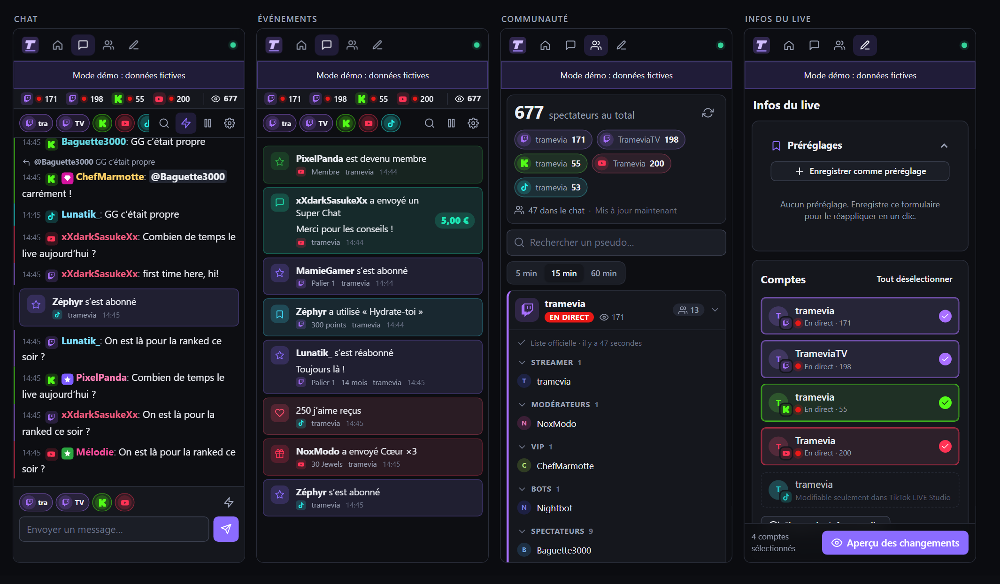
</p>

<p align="center"><sub>Les quatre docks, en mode démo. Un <b>dock</b>, c’est un petit panneau que tu ranges dans la fenêtre d’OBS, à côté de tes scènes : toi seul le vois.</sub></p>

### 👀 En action

<table>
  <tr>
    <td width="50%" align="center">
      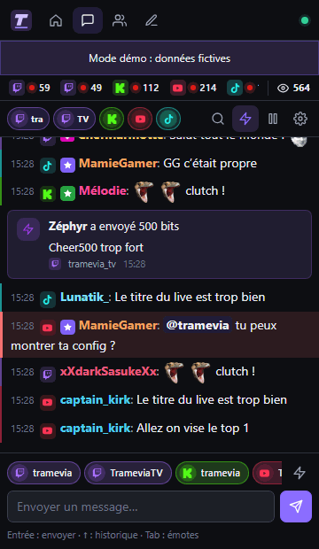
    </td>
    <td width="50%">
      <p><b>Tout ton chat dans un seul fil.</b><br>Les messages de toutes tes chaînes arrivent au même endroit, chacun avec l’icône de sa plateforme.</p>
      <p><b>Les émotes que ta commu connaît.</b><br>Émotes natives, 7TV, BTTV et FFZ, badges, et les mentions qui te concernent bien en vue.</p>
      <p><b>Les événements au milieu du chat.</b><br>Bits, abonnements, Super Chats, raids, cadeaux : tu ne rates personne.</p>
      <p><b>Tu écris une fois, tu choisis où.</b><br>Envoie ton message sur un seul compte ou sur plusieurs à la fois, réponds et modère sans changer d’onglet.</p>
    </td>
  </tr>
</table>

## 💜 Pourquoi Tramevia Dock ?

- 💬 **Un seul chat pour toutes tes plateformes.** Twitch, Kick, YouTube et TikTok (en lecture seule) dans le même dock. Tu lis, tu réponds et tu modères sans jongler entre les onglets.
- 🏷️ **Titre, catégorie et tags partout en un clic.** Tu remplis une fois, tu vérifies l’aperçu, tu appliques. Tes réglages préférés deviennent des préréglages.
- 🏠 **Tes données restent chez toi.** Tramevia Dock tourne sur ton PC : aucun compte Tramevia à créer, pas de serveur Tramevia au milieu, et tes accès sont chiffrés sur ton disque.
- 🎁 **Gratuit et libre.** Open source (AGPL-3.0), sans abonnement, en français et en anglais.

## 🧭 Comment ça marche

<p align="center">
  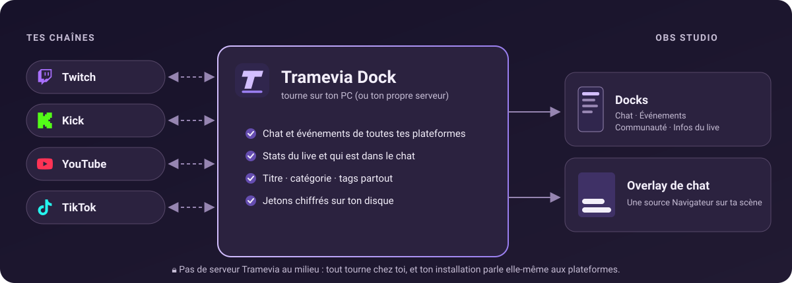
</p>

Tramevia Dock est un petit programme qui tourne sur ton PC. Il se connecte directement à tes chaînes et rassemble tout au même endroit. OBS l’affiche ensuite de deux façons : des **docks**, visibles par toi seul, et un **overlay**, c’est-à-dire ton chat affiché par-dessus ta scène, que tes spectateurs voient sur le stream.

<a id="tuto"></a>

## 🚀 Tuto : de zéro à ton premier live en 10 minutes environ

Cinq étapes, dans l’ordre. Pas besoin de savoir coder : tu cliques, tu copies, tu colles.

**Ce qu’il te faut :** un ordinateur sous Windows, macOS ou Linux, [OBS Studio](https://obsproject.com) 31 ou plus récent, et une connexion internet.

<a id="etape-1"></a>

### 1️⃣ Installe Tramevia Dock

1. **Installe Node.js.** C’est le moteur qui fait tourner Tramevia Dock. Sur [nodejs.org](https://nodejs.org), télécharge la version **LTS** (24.15 ou plus récente), lance l’installateur et garde les options par défaut.
2. **Télécharge Tramevia Dock.** Sur la [page des versions](https://github.com/Tramevia/Tramevia-Dock/releases/latest), télécharge le ZIP de la dernière version (`tramevia-dock-X.Y.Z.zip`, dans **Assets**).
3. **Extrais le ZIP** : clic droit sur le fichier → « Extraire tout… ». Choisis un dossier qui ne bougera pas, par exemple `Documents\Tramevia Dock`.
4. **Double-clique sur `start.bat`.** Si Windows te demande une confirmation, accepte. Une fenêtre noire s’ouvre : c’est Tramevia Dock qui tourne. Sur macOS, c’est `start.command` ; sur Linux, `./start.sh` dans un terminal (voir [Autres façons d’installer](#autres-installations)).
5. **Ton navigateur s’ouvre** sur <http://localhost:8787>. C’est ton tableau de bord !

**Laisse la fenêtre noire (le Terminal sur macOS) ouverte pendant que tu streames :** c’est elle qui fait tourner Tramevia Dock. Si tu la fermes, tes docks se vident.

> [!TIP]
> Tu veux d’abord faire le tour du propriétaire ? Double-clique plutôt sur `demo.bat` (macOS et Linux : `./start.sh --demo`). De faux comptes, du faux chat et de faux événements remplissent tout, et rien n’est envoyé aux plateformes.

<p align="center">
  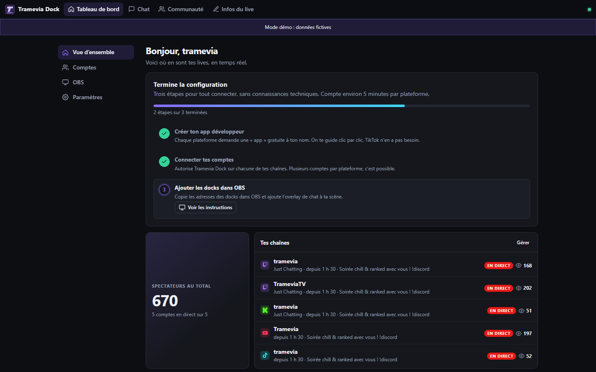
</p>
<p align="center"><sub>Au premier lancement, le tableau de bord te propose trois étapes. On les suit ensemble juste en dessous.</sub></p>

### 2️⃣ Connecte ta première plateforme

Tramevia Dock n’a pas de serveur central. Pour parler à ta chaîne, il utilise une **app développeur** à ton nom : pas de panique, c’est simplement une autorisation gratuite que tu crées sur la plateforme. Grâce à elle, Tramevia Dock ne connaît jamais ton mot de passe.

1. Dans le tableau de bord, ouvre **Comptes** et clique sur « Configurer l’app Twitch ».
2. Suis les étapes numérotées. Des boutons ouvrent les bonnes pages, et les boutons « Copier » te donnent le nom de l’app et l’adresse à coller.
3. Colle ton **Client ID** et ton **Client Secret** dans « Colle tes identifiants ici », puis clique sur « Enregistrer et tester ».
4. Clique sur « Connecter mon compte Twitch » et accepte sur la page de Twitch. C’est connecté !

<p align="center">
  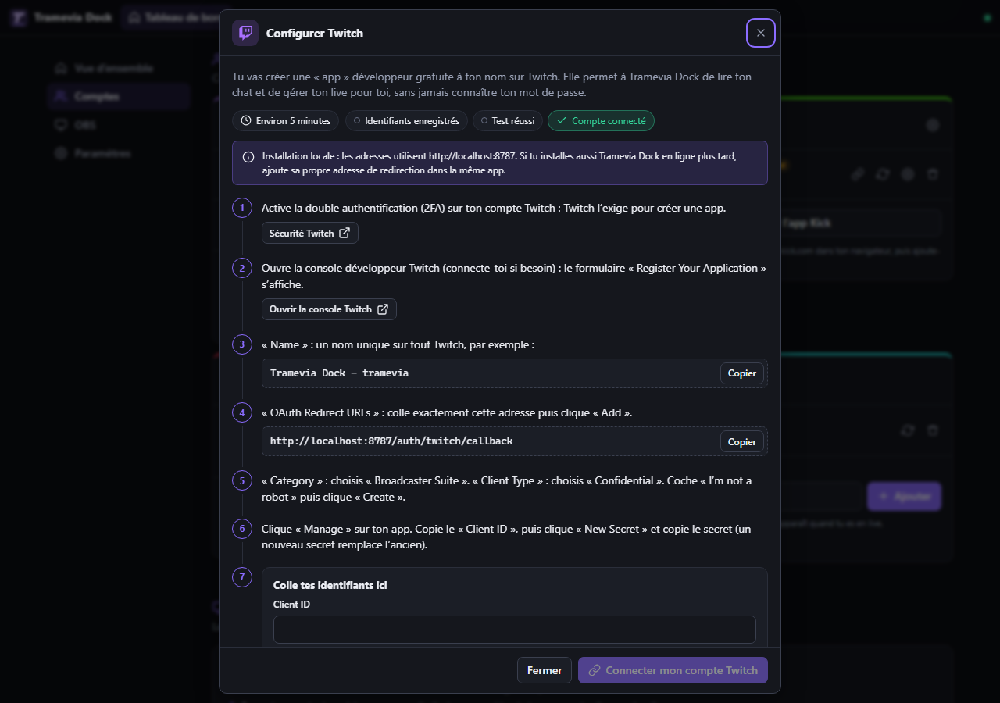
</p>

> [!NOTE]
> Compte environ 5 minutes par plateforme. Kick et YouTube suivent le même principe, et Twitch comme Kick demandent d’activer la double authentification (2FA) : l’assistant te donne le lien. Sur YouTube, Google affichera « Cette application n’a pas été validée » : c’est normal, c’est ta propre app. Pour **TikTok**, rien à créer : tape juste ton @pseudo et clique sur « Ajouter ». Le pas-à-pas complet est dans le [guide des plateformes](docs/fr/platforms.md).

### 3️⃣ Ajoute les docks dans OBS

1. Dans le tableau de bord, ouvre **OBS**. La carte « Docks OBS » te donne une adresse par dock : Chat unifié, Événements, Communauté, Infos du live et Tableau de bord.
2. Clique sur « Copier » à côté du dock que tu veux.
3. Dans OBS, ouvre le menu **Docks → Docks de navigateur personnalisés…**.
4. Donne un nom au dock (par exemple « Chat »), colle l’adresse dans la colonne URL, puis clique sur « Appliquer ».
5. Recommence pour chaque dock, range-les où tu veux, puis clique sur « J’ai ajouté mes docks » dans le tableau de bord.

<p align="center">
  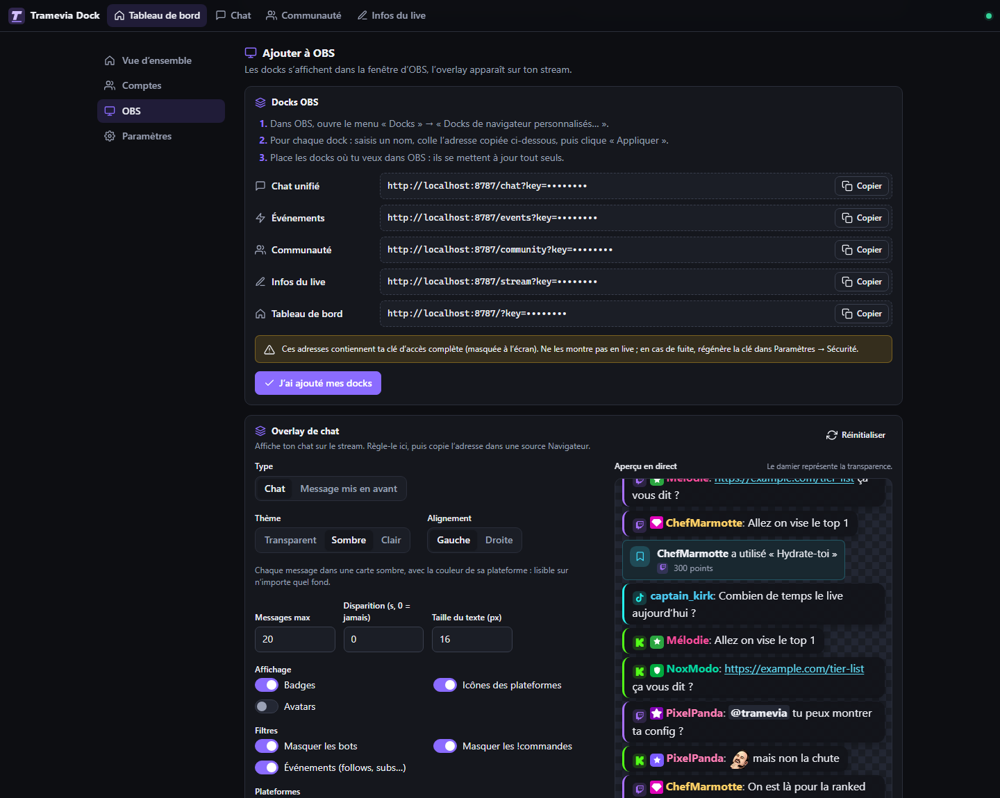
</p>

> [!IMPORTANT]
> Il te faut **OBS Studio 31 ou plus récent** : le navigateur intégré d’OBS 30 est trop ancien pour le dock de chat.

> [!WARNING]
> Ces adresses contiennent ta clé d’accès, c’est pour ça qu’elle est masquée à l’écran. Ne les montre jamais en live et ne les partage pas. En cas de fuite : **Paramètres → Sécurité → Clé des docks → « Régénérer »**, puis recopie les nouvelles adresses dans OBS.

### 4️⃣ Affiche ton chat sur le stream

L’overlay se règle dans la même section **OBS**, juste sous les docks.

1. Dans la carte « Overlay de chat », choisis un **Thème**. L’« Aperçu en direct » te montre le résultat au fur et à mesure.
2. Copie l’« Adresse de l’overlay ».
3. Dans OBS : **Sources → + → Navigateur**, donne un nom à la source, colle l’adresse dans le champ URL, mets la largeur à **400** et la hauteur à **600**, puis valide.

<p align="center">
  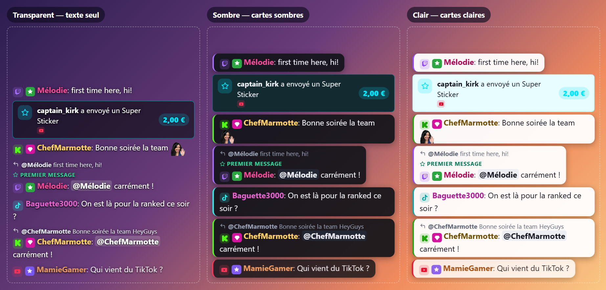
</p>

- **Transparent** : le texte seul, posé directement sur ta scène. Active « Bulles » ou « Contour du texte » si ton fond est chargé.
- **Sombre** : chaque message dans une carte sombre, avec la couleur de sa plateforme. Lisible sur n’importe quel fond.
- **Clair** : chaque message dans une carte claire à texte foncé, avec la couleur de sa plateforme.

Les réglages font partie de l’adresse : si tu les changes, recolle la nouvelle adresse dans la source. L’overlay utilise une clé à part, en lecture seule : son adresse ne permet aucune action sur tes comptes.

> [!TIP]
> Envie de mettre une seule question à l’écran ? Choisis le type « Message mis en avant », ajoute cette adresse comme deuxième source Navigateur, puis, dans le dock Chat, survole un message et clique sur son étoile « Afficher sur l’overlay ». Tous les réglages : [guide OBS](docs/fr/obs.md).

### 5️⃣ Avant chaque live : titre, catégorie et tags partout

1. Ouvre le dock « Infos du live » (ou l’onglet du même nom dans ton navigateur) et vérifie les comptes cochés.
2. Clique sur « Charger les infos actuelles » : le formulaire se remplit, rien n’est envoyé.
3. Change le **Titre**, cherche ta **Catégorie** une seule fois (chaque plateforme est cherchée, jaquettes à l’appui) et ajoute tes **Tags**.
4. Clique sur « Aperçu des changements » pour voir l’avant et l’après, puis sur « Appliquer à … comptes ».

<p align="center">
  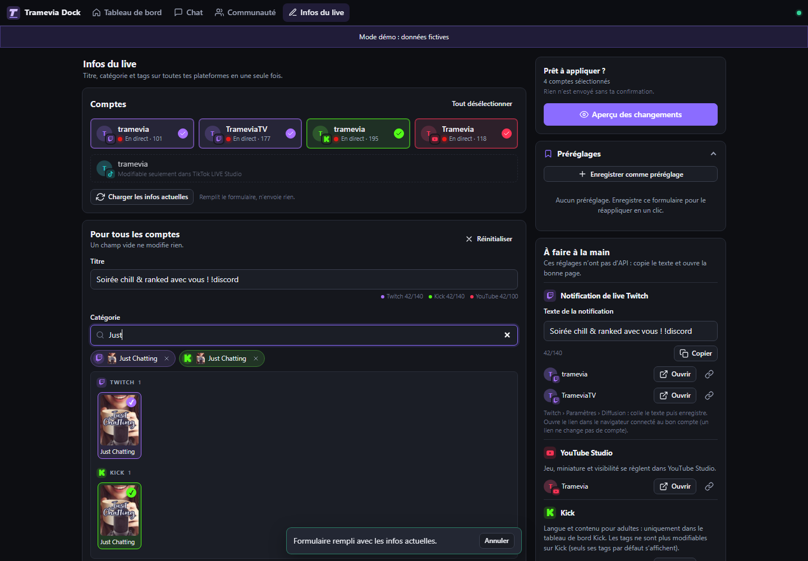
</p>

Ce que les plateformes ne permettent pas de changer à distance (le texte de notification de live Twitch, le « Jeu » YouTube…) t’attend dans la rubrique « À faire à la main », avec le texte à copier et le bon lien. Sur **YouTube**, le titre appartient à un direct précis : programme d’abord ton live dans YouTube Studio (ou lance-le). Sur **TikTok**, le titre se change uniquement dans l’app TikTok ou LIVE Studio.

> [!TIP]
> Tu fais souvent le même genre de live ? Clique sur « Enregistrer comme préréglage » (par exemple « Soirée ranked ») : la prochaine fois, un clic remplit tout le formulaire, et il ne te reste qu’à appliquer.

**Et voilà, tout est prêt. Bon live !** 🎉

<a id="fonctionnalites"></a>

## ✨ Fonctionnalités

<table>
  <tr>
    <td width="50%" align="center" valign="top">
      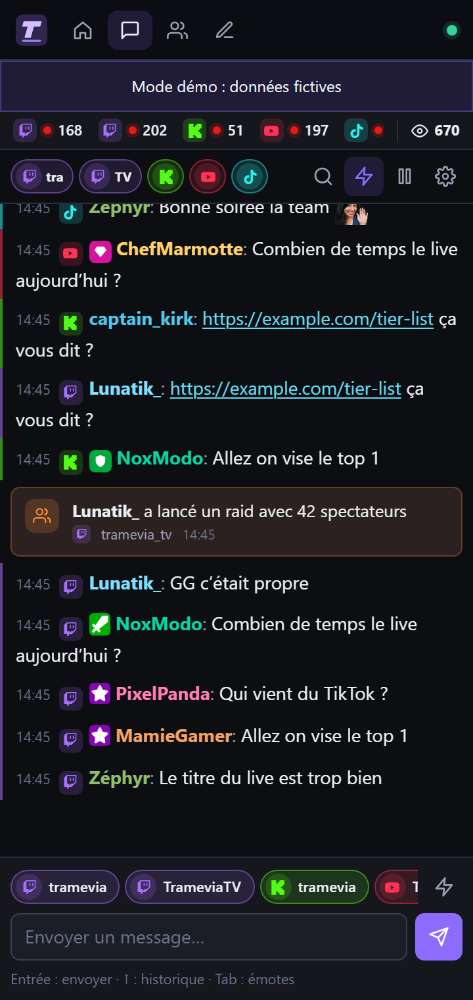<br>
      <b>Chat unifié</b><br>
      <sub>Lecture, envoi multi-comptes, réponses et modération</sub>
    </td>
    <td width="50%" align="center" valign="top">
      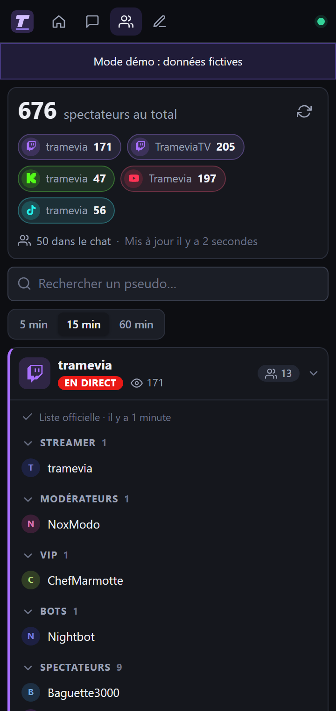<br>
      <b>Communauté</b><br>
      <sub>Total de spectateurs et qui est dans ton chat</sub>
    </td>
  </tr>
  <tr>
    <td width="50%" align="center" valign="top">
      <br>
      <b>Infos du live</b><br>
      <sub>Titre, catégorie et tags sur toutes tes chaînes</sub>
    </td>
    <td width="50%" align="center" valign="top">
      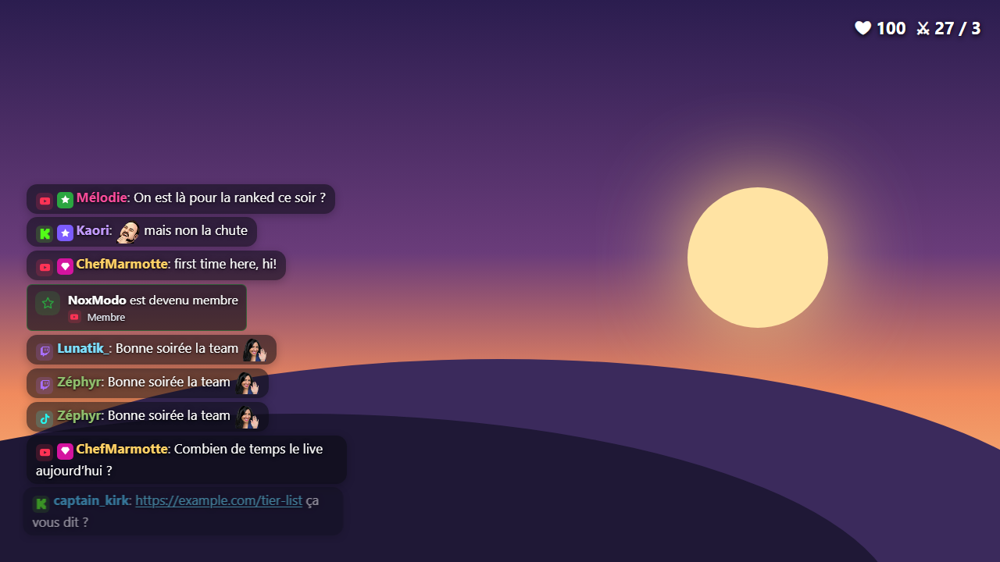<br>
      <b>Overlay</b><br>
      <sub>Ton chat sur le stream, sans une ligne de CSS</sub>
    </td>
  </tr>
  <tr>
    <td colspan="2" align="center" valign="top">
      <br>
      <b>Tableau de bord</b><br>
      <sub>Tes chaînes en direct, tes comptes, OBS et les paramètres</sub>
    </td>
  </tr>
</table>

<details>
<summary><b>📋 La liste complète des fonctionnalités</b></summary>

**💬 Chat et événements**

- Chat unifié de tous tes comptes, avec filtre par compte, recherche, pause automatique au survol et pastille « N nouveaux messages ».
- Émotes natives, plus 7TV, BTTV et FFZ selon la plateforme. Badges, cheermotes Twitch, liens et mentions.
- Envoi sur plusieurs comptes à la fois (« Envoyer sur »), réponses, historique avec ↑ et autocomplétion des émotes avec Tab.
- Modération depuis le chat (supprimer, exclure temporairement, bannir, débannir), dans la limite de ce que chaque plateforme permet.
- Fiche utilisateur : ses messages de la session et, sur Twitch, la date de création du compte et de follow.
- Premiers messages, mentions et mots-clés mis en évidence, avec un son facultatif quand on te mentionne.
- Fil d’événements : follows, abonnements, abonnements offerts, Bits, KICKs, Super Chats, Super Stickers, adhésions, Jewels, raids, points de chaîne, cadeaux TikTok…
- Marqueur et clip Twitch en un clic.

**👥 Communauté**

- Nombre total de spectateurs, et le détail par chaîne.
- Sur Twitch, la liste officielle des personnes présentes dans le chat, rangées par rôle (streamer, modérateurs, VIP, bots).
- Sur Kick, YouTube et TikTok, qui ne fournissent pas cette liste : les personnes actives ces 5, 15 ou 60 dernières minutes.

**🏷️ Infos du live**

- Titre, catégorie et tags sur tous tes comptes en une fois, avec personnalisation compte par compte.
- Une seule recherche de catégorie pour toutes les plateformes, avec les jaquettes.
- Les réglages propres à chaque plateforme : langue, classification du contenu et contenu de marque sur Twitch ; description et catégorie sur YouTube.
- Préréglages réutilisables, aperçu des changements avant envoi, résultat par compte et bouton pour réessayer seulement les échecs.
- Une rubrique « À faire à la main » pour ce qui n’a pas d’API, avec le texte à copier et le bon lien.

**🖼️ Overlay**

- Overlay de chat transparent pour une source Navigateur d’OBS, réglé entièrement par son adresse (thème, taille, disparition, filtres…).
- Mode « Message mis en avant » : tu choisis un message dans le dock Chat, il s’affiche à l’écran.
- Aperçu en direct dans le tableau de bord pendant que tu règles.

**🛡️ Installation et sécurité**

- Assistant pas à pas pour chaque plateforme, avec les adresses exactes à copier et un bouton « Tester ».
- Plusieurs comptes par plateforme (par exemple deux chaînes Twitch).
- Jetons chiffrés sur le disque, mot de passe obligatoire dès que l’app est joignable depuis le réseau, clés d’accès régénérables pour les docks et l’overlay.
- En local sur Windows, macOS ou Linux, ou en ligne avec Docker ou Railway. Interface en français et en anglais.

</details>

## 📡 Plateformes prises en charge

**En bref :** tout marche sur Twitch, presque tout sur Kick et YouTube, et TikTok est en lecture seule (tu lis ton chat, sans pouvoir y écrire).

Légende : ✅ officiel · 🟡 officiel mais limité · ⚠️ non officiel · ❌ impossible

| | Twitch | Kick | YouTube | TikTok LIVE |
|---|---|---|---|---|
| Lire le chat | ✅ | ✅ webhooks (en ligne)<br>⚠️ Pusher (en local) | ✅ | ⚠️ lecture seule |
| Envoyer des messages | ✅ 500 car. | ✅ 500 car. | 🟡 200 car., 50 unités de quota par message | ❌ |
| Répondre à un message | ✅ | ✅ | ❌ | ❌ |
| Modération (supprimer, exclure, bannir, débannir) | ✅ exclusion de 1 s à 14 j | ✅ exclusion de 1 min à 7 j | 🟡 50 unités par action, exclusion jusqu’à 24 h, débannissement limité | ❌ |
| Qui est dans le chat | ✅ liste officielle, avec les rôles | 🟡 personnes actives | 🟡 personnes actives | ⚠️ personnes actives |
| Spectateurs et statut du live | ✅ | ✅ | ✅ sauf si tu masques le compteur | ⚠️ |
| Titre | ✅ 140 car. | ✅ | ✅ 100 car., sur un direct en cours ou programmé | ❌ app TikTok ou LIVE Studio |
| Catégorie | ✅ recherche et jaquettes | ✅ recherche et jaquettes | 🟡 liste fixe, le « Jeu » se règle dans YouTube Studio | ❌ |
| Tags | ✅ 10 tags de 25 car. | ❌ plus modifiables sur Kick | ✅ 500 car. au total | ❌ |
| Événements | ✅ follows, abonnements, Bits, raids, points de chaîne | ✅ webhooks<br>⚠️ Pusher<br>follows, abonnements, KICKs, récompenses | 🟡 Super Chats, Super Stickers, adhésions, Jewels ; ni follows ni abonnements | ⚠️ cadeaux, follows, partages, abonnements, likes |
| Marqueur et clip | ✅ | ❌ | ❌ | ❌ |

> [!NOTE]
> **Bon à savoir**
>
> - **TikTok LIVE** n’a pas d’API pour les lives. Tramevia Dock lit ton chat, tes cadeaux et tes spectateurs en **lecture seule**, via la bibliothèque non officielle [tiktok-live-connector](https://github.com/zerodytrash/TikTok-Live-Connector) et le serveur de signature d’Euler Stream. Ça peut cesser de fonctionner après une mise à jour de TikTok.
> - **Kick en local** : le chat passe par le socket Pusher non officiel qu’utilise kick.com lui-même. Les webhooks officiels demandent une adresse publique en HTTPS, donc une installation en ligne. L’envoi de messages, la modération et les infos du live passent par l’API officielle dans les deux cas.
> - **YouTube** : chaque action consomme du quota (10 000 unités par jour et par projet Google Cloud). Tramevia Dock affiche une estimation et met l’envoi en pause avant la limite.
> - Aucune plateforme ne permet de modifier le texte de notification de live par API. Pour Twitch, le dock « Infos du live » te prépare le texte et le lien vers la bonne page.

Le détail plateforme par plateforme est dans le [guide des plateformes](docs/fr/platforms.md).

<a id="autres-installations"></a>

## 🧰 Autres façons d’installer

<details>
<summary><b>Windows, pas à pas</b></summary>

1. **Installe Node.js.** Sur [nodejs.org](https://nodejs.org), télécharge l’installateur Windows de la version **LTS** (fichier `.msi`). Lance-le et clique sur « Next » jusqu’au bout.
2. **Télécharge Tramevia Dock** : le ZIP de la dernière version sur la [page des versions](https://github.com/Tramevia/Tramevia-Dock/releases/latest) (`tramevia-dock-X.Y.Z.zip`, dans **Assets**).
3. **Extrais le ZIP** : clic droit → « Extraire tout… », dans un dossier qui ne bougera pas, par exemple `Documents\Tramevia Dock`. Ne lance rien directement depuis l’intérieur du ZIP.
4. **Double-clique sur `start.bat`.** Une fenêtre noire intitulée « Tramevia Dock » s’ouvre. Si Node.js manque, elle te le dit et ouvre nodejs.org ; s’il est plus ancien que la version 24.15, elle te demande de le mettre à jour.
5. **Ton navigateur s’ouvre** sur <http://localhost:8787>.

Pour arrêter Tramevia Dock, ferme la fenêtre noire (ou appuie sur Ctrl+C dedans). Il n’y a pas de `.exe` : `start.bat` est un simple fichier texte, que tu peux ouvrir dans le Bloc-notes. Si Windows te demande une confirmation avant de l’exécuter, accepte.

Tes comptes, tes réglages et tes clés vivent dans le dossier `data` : **sauvegarde-le, et surtout `secret.key`**. Les mises à jour s’installent en un clic : voir [Mises à jour](#mises-a-jour). Désinstallation et réglages avancés : [guide d’installation](docs/fr/install.md).

</details>

<details>
<summary><b>macOS et Linux</b></summary>

Installe d’abord **Node.js 24.15 ou plus récent** depuis [nodejs.org](https://nodejs.org) (ou le gestionnaire de paquets de ta distribution, s’il est assez récent).

**macOS** : télécharge et décompresse le ZIP, puis double-clique sur `start.command`. Si macOS refuse de l’ouvrir parce qu’il vient d’un développeur non identifié, fais un clic droit sur le fichier → « Ouvrir », ou va dans **Réglages Système → Confidentialité et sécurité** → « Ouvrir quand même ».

**Linux** :

```bash
git clone https://github.com/Tramevia/Tramevia-Dock.git
cd Tramevia-Dock
./start.sh
```

« Permission denied » ? Rends les scripts exécutables avec `chmod +x start.sh start.command`. Sous Wayland, OBS peut ne pas proposer les docks de navigateur : ouvre leurs adresses dans une fenêtre de navigateur classique.

Tous les détails : [guide d’installation](docs/fr/install.md#macos).

</details>

<details>
<summary><b>Docker</b></summary>

Il te faut Docker avec Compose. Pas besoin du code : l’image prête à l’emploi `ghcr.io/tramevia/tramevia-dock` est publiée à chaque version. Dans un nouveau dossier, mets [`compose.yaml`](compose.yaml) et un fichier `.env` avec au minimum :

```env
ADMIN_PASSWORD=choisis-un-mot-de-passe-long
```

puis lance :

```bash
docker compose up -d
```

Ouvre <http://localhost:8787> et connecte-toi avec ton mot de passe. Dans Docker, le mot de passe est **obligatoire, même en local** (12 caractères minimum). Tes données vivent dans un volume monté sur `/data`.

Pour mettre à jour : `docker compose pull && docker compose up -d` (ou active la mise à jour automatique de nuit, facultative). Journaux, mises à jour automatiques et `docker run` : [guide de l’hébergement en ligne](docs/fr/cloud.md#docker-compose).

</details>

<details>
<summary><b>En ligne : Railway, serveur ou tunnel</b></summary>

Tu peux faire tourner Tramevia Dock sur un serveur, sur [Railway](https://railway.com) (payant) ou derrière un tunnel. C’est utile pour ouvrir tes docks depuis n’importe où, lire le chat Kick par les webhooks officiels et, sur un serveur, suivre ton chat même PC éteint.

À savoir :

- `ADMIN_PASSWORD` est obligatoire (12 caractères minimum).
- Sur un serveur ou sur Railway, il faut un volume persistant sur `/data` et du HTTPS devant.
- Sur Railway (offre Hobby, payante) : déploie l’image Docker `ghcr.io/tramevia/tramevia-dock`, ajoute **`RAILWAY_RUN_UID=0`** et active ses **Auto Updates** : les nouvelles versions s’installent alors toutes seules la nuit. Un bouton **Deploy on Railway** (déploiement en un clic) arrive avec la première version publique.
- Les adresses de redirection commencent par ton adresse publique : ajoute-les à tes apps.
- Une installation en ligne est indépendante de ton installation locale : elle a ses propres comptes et réglages.

Le pas-à-pas (Railway, reverse proxy, tunnel, sauvegardes) : [guide de l’hébergement en ligne](docs/fr/cloud.md).

<!-- RAILWAY_BUTTON : remplacer ce commentaire par les lignes ci-dessous quand le modèle Railway existe (RELEASING.md, mise en place unique, étape 7), et retirer la phrase « arrive avec la première version publique » plus haut.
[](https://railway.com/new/template/<CODE>?utm_medium=integration&utm_source=button&utm_campaign=tramevia-dock)
Il faut l’offre Hobby de Railway. Tu ne remplis qu’un mot de passe ; les mises à jour s’installent toutes seules la nuit (heure UTC). Tu peux changer le créneau dans Settings → Source → Auto Updates.
-->

</details>

<a id="mises-a-jour"></a>

## 🔄 Mises à jour

Tramevia Dock vérifie une fois par jour si une nouvelle version est sortie, et te prévient sur le tableau de bord. Tes comptes, tes réglages et tes docks OBS restent exactement comme avant.

- 💻 **Installation ZIP** : clique sur « Installer maintenant » dans le message. Tramevia Dock redémarre tout seul en quelques secondes, jamais pendant un live, et revient à la version précédente si la nouvelle ne démarre pas. Tu préfères ne rien faire ? Active l’installation automatique dans **Paramètres → À propos**.
- 🐳 **Docker** : `docker compose pull && docker compose up -d`, ou active la mise à jour automatique de nuit (facultative).
- ☁️ **Railway** : active une fois les **Auto Updates** de Railway, et les nouvelles versions s’installent toutes seules la nuit.

Installé avec `git clone` ? Lance `git pull` puis relance-le. Tous les détails : [Mettre à jour](docs/fr/install.md#mettre-à-jour).

<a id="faq"></a>

## ❓ FAQ

<details>
<summary><b>C’est vraiment gratuit ?</b></summary>

Oui. Tramevia Dock est gratuit et libre. Les apps développeur de Twitch, Kick et Google sont gratuites, l’API YouTube aussi dans la limite du quota quotidien, et l’offre gratuite d’Euler Stream suffit en général pour TikTok. Seul un hébergement en ligne (Railway, serveur…) peut te coûter quelque chose ; sur ton PC, tout est gratuit.

</details>

<details>
<summary><b>Il faut savoir coder ?</b></summary>

Non. Tu double-cliques sur un fichier, et l’assistant te guide clic par clic, avec des boutons « Copier » pour tout ce qu’il faut coller. L’étape la plus technique, c’est la création de l’app développeur sur chaque plateforme : environ 5 minutes, guidées de bout en bout. Les réglages avancés (fichier `.env`) sont facultatifs en local.

</details>

<details>
<summary><b>C’est sûr ? Où sont stockés mes mots de passe ?</b></summary>

Tramevia Dock ne voit jamais le mot de passe de tes comptes : tu te connectes sur la page officielle de chaque plateforme, qui lui donne ensuite un accès. Il ne demande jamais ta clé de stream non plus.

Ces accès (les « jetons ») et les secrets de tes apps sont chiffrés sur ton disque, dans le dossier `data`. Sans mot de passe, le tableau de bord n’est accessible que depuis ton ordinateur. Ta part du travail : ne montre pas les adresses des docks en live, et ne partage ni ton dossier `data` ni ton `.env`. Plus de détails dans [Sécurité et confidentialité](#sécurité-et-confidentialité).

</details>

<details>
<summary><b>Ça marche avec Streamlabs ou un autre logiciel qu’OBS ?</b></summary>

Tramevia Dock est pensé pour **OBS Studio 31 ou plus récent** et ses docks de navigateur personnalisés. Le tableau de bord et les docks sont de simples pages web : tu peux aussi les ouvrir dans ton navigateur, à côté de n’importe quel logiciel. L’overlay est une adresse prévue pour une source Navigateur d’OBS ; les autres logiciels de stream ne sont pas testés.

</details>

<details>
<summary><b>Pourquoi TikTok est « non officiel » ?</b></summary>

TikTok ne propose aucune API pour les lives. Tramevia Dock passe donc par la bibliothèque non officielle [tiktok-live-connector](https://github.com/zerodytrash/TikTok-Live-Connector), qui se branche sur le même flux que l’app TikTok. C’est en **lecture seule** : chat, cadeaux, follows, spectateurs… mais pas d’envoi de messages, pas de modération et pas de titre. Et ça peut cesser de fonctionner après une mise à jour de TikTok, jusqu’à la prochaine version de Tramevia Dock.

</details>

<details>
<summary><b>Le chat Kick marche en local ?</b></summary>

Oui. Kick ne propose officiellement le chat en temps réel que par webhooks, qui demandent une adresse publique en HTTPS. Sur ton PC, Tramevia Dock utilise donc le socket Pusher, celui qu’utilise kick.com lui-même : ça marche, mais c’est non officiel. L’envoi de messages, la modération et le titre passent toujours par l’API officielle.

Si le chat ne se connecte pas, tu peux saisir le numéro de ton salon de chat à la main dans **Comptes → ton compte Kick → « Options »**. Voir [comment le chat Kick est lu](docs/fr/platforms.md#comment-le-chat-kick-est-lu).

</details>

<details>
<summary><b>C’est quoi, le quota YouTube ?</b></summary>

Google accorde **10 000 unités par jour** à chaque projet Google Cloud. Envoyer un message coûte 50 unités, une action de modération aussi, et changer le titre environ 51. Une journée avec un live de 4 heures consomme environ 830 unités sans compter tes messages ; 40 messages envoyés, c’est 2 000 unités de plus.

Tramevia Dock affiche une estimation sur ta carte de compte (« Quota API : … unités ») et met l’envoi, la modération et la modification des infos en pause à 95 % de la limite, jusqu’à minuit heure du Pacifique (vers 9 h du matin en France). Voir [le quota quotidien](docs/fr/platforms.md#le-quota-quotidien).

</details>

<details>
<summary><b>Je peux l’utiliser sur deux PC ?</b></summary>

Oui, de deux façons :

- **Une seule installation, plusieurs appareils** : fais tourner Tramevia Dock sur un PC (ou en ligne) et ouvre-le depuis l’autre. Il faut alors un `ADMIN_PASSWORD`. Voir [l’hébergement en ligne](docs/fr/cloud.md#autres-hébergeurs-et-reverse-proxy), paragraphe « Depuis un autre appareil de ton réseau local ».
- **Une installation par PC** : chaque installation est indépendante, avec ses propres comptes et réglages. Tu connectes tes comptes sur chacune ; la même app Twitch et le même client Google peuvent servir aux deux. Le quota YouTube de ton projet Google est alors partagé, et chaque installation ne compte que sa propre consommation.

Tu changes simplement de PC ? Copie le dossier `data` en entier, avec `secret.key` : voir [J’ai changé de PC](docs/fr/faq.md#jai-changé-de-pc).

</details>

D’autres questions ? La [FAQ et dépannage](docs/fr/faq.md) reprend les messages d’erreur un par un. Tu peux aussi [signaler un problème](https://github.com/Tramevia/Tramevia-Dock/issues).

📚 Les guides complets : [Installation](docs/fr/install.md) · [Plateformes](docs/fr/platforms.md) · [OBS](docs/fr/obs.md) · [En ligne](docs/fr/cloud.md) · [FAQ](docs/fr/faq.md)

<a id="sécurité-et-confidentialité"></a>

## 🔒 Sécurité et confidentialité

- **Hébergé chez toi.** Tes jetons ne quittent ton PC (ou ton serveur) que pour parler aux plateformes elles-mêmes. Pas de serveur Tramevia, pas de télémétrie.
- **Jamais tes mots de passe.** Tu te connectes sur la page officielle de chaque plateforme. Tramevia Dock ne voit ni ton mot de passe ni ta clé de stream.
- **Chiffré.** Les jetons d’accès et les secrets de tes apps sont chiffrés sur le disque (AES-256-GCM), avec la clé `TOKEN_KEY` ou le fichier `data/secret.key` créé au premier lancement. Garde une copie de ce fichier.
- **Local par défaut.** Sans `ADMIN_PASSWORD`, le serveur n’écoute que sur `127.0.0.1` et ne répond qu’à ton ordinateur. Dès que Tramevia Dock est joignable depuis le réseau (en ligne, réseau local, tunnel), `ADMIN_PASSWORD` est obligatoire, avec 12 caractères minimum, et les tentatives de connexion sont limitées.
- **Clés d’accès.** Les adresses des docks contiennent une clé d’accès complet ; celle de l’overlay, une clé séparée en lecture seule. Traite-les comme des mots de passe : tu peux les régénérer dans **Paramètres → Sécurité**.
- **Déconnecter** un compte efface ses jetons, et Tramevia Dock essaie aussi de révoquer son accès auprès de la plateforme.

<details>
<summary><b>Le détail : ce qui est enregistré, et ce qui sort de ton PC</b></summary>

**Données enregistrées** (dans `data/tramevia-dock.db`) : tes réglages, tes préréglages, les identifiants chiffrés de tes apps, les clés des docks et de l’overlay, et pour chaque compte connecté son pseudo, son avatar, les permissions accordées et ses jetons chiffrés. S’y ajoutent les identifiants des personnes qui ont déjà écrit dans ton chat (pour repérer les premiers messages), ceux des bannissements YouTube faits depuis Tramevia Dock (pour pouvoir les lever), un compteur de quota YouTube et le numéro de ton salon de chat Kick. Les messages du chat et les événements restent en mémoire uniquement (les 400 derniers) et ne sont pas écrits sur le disque.

**Connexions sortantes** : les plateformes elles-mêmes (Twitch, Kick, Google/YouTube, TikTok), le socket Pusher qu’utilise kick.com (chat Kick en mode non officiel), les services d’émotes 7TV, BTTV et FFZ (avec l’identifiant de ta chaîne), le serveur de signature Euler Stream pour TikTok, et GitHub une fois par jour pour vérifier s’il existe une nouvelle version (désactivable dans **Paramètres → À propos**, ou avec `UPDATE_CHECK=0`).

</details>

**YouTube.** Tramevia Dock utilise les services d’API YouTube. En connectant ta chaîne, tu acceptes les [Conditions d’utilisation de YouTube](https://www.youtube.com/t/terms) ; les données sont traitées selon les [Règles de confidentialité de Google](https://policies.google.com/privacy). Tu peux retirer l’accès à tout moment depuis la [page des autorisations de ton compte Google](https://security.google.com/settings/security/permissions), ou avec le bouton « Déconnecter » du tableau de bord.

**Une faille de sécurité ?** Suis [SECURITY.md](SECURITY.md) et merci de ne pas ouvrir d’issue publique.

## 🤝 Contribuer, licence et crédits

**Contribuer.** Les idées, les rapports de bugs et les contributions sont les bienvenus ! Avant de proposer un changement, lis [CONTRIBUTING.md](CONTRIBUTING.md). Pour bidouiller sans aucun compte, `npm run demo` lance le mode démo et `npm test` lance les tests.

[Signaler un problème](https://github.com/Tramevia/Tramevia-Dock/issues) · [Journal des versions](CHANGELOG.md)

**Licence.** [AGPL-3.0](LICENSE). En clair : tu peux utiliser, étudier, modifier et partager Tramevia Dock librement. Si tu distribues une version modifiée, ou si tu la fais tourner pour d’autres personnes à travers un réseau, tu dois partager ton code source sous la même licence.

**Crédits.**

- [tiktok-live-connector](https://github.com/zerodytrash/TikTok-Live-Connector) pour la lecture des lives TikTok (AGPL-3.0)
- [ws](https://github.com/websockets/ws) pour les WebSockets
- [Simple Icons](https://simpleicons.org) pour les icônes des plateformes (CC0)
- [7TV](https://7tv.app), [BetterTTV](https://betterttv.com) et [FrankerFaceZ](https://www.frankerfacez.com) pour leurs émotes

---

<sub>Tramevia Dock est un projet indépendant. Il n’est ni affilié à Twitch, Kick, YouTube, Google ou TikTok, ni approuvé ou sponsorisé par eux. Ces noms et logos sont des marques de leurs propriétaires respectifs ; les icônes servent uniquement à identifier les plateformes.</sub>

<p align="center"><a href="#top">↑ Retour en haut</a></p>
