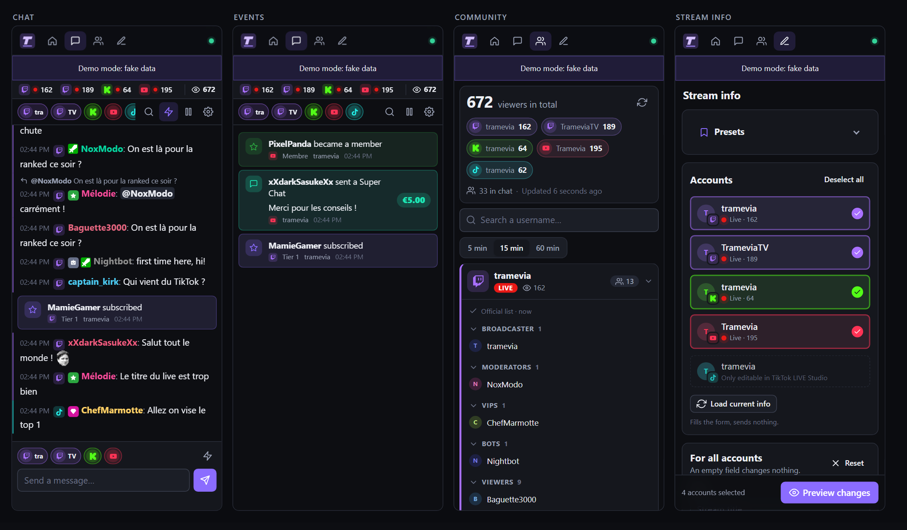
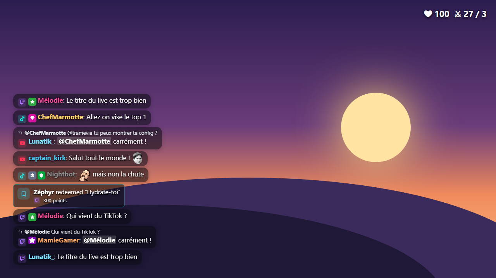

<p align="right"><a href="README.fr.md">🇫🇷 Français</a></p>

<p align="center">
  
</p>

<h1 align="center">Tramevia Dock</h1>

<p align="center">
  Your multistream control room for OBS: one chat, one event feed and one place to set the title, category and tags on Twitch, Kick, YouTube and TikTok LIVE.
</p>

<p align="center">
  <a href="LICENSE"></a>
  
  
</p>



- **One chat for every platform.** Read, reply and moderate Twitch, Kick and YouTube from a single OBS dock, with TikTok LIVE alongside.
- **Change your stream info everywhere at once.** Title, category and tags for every channel, with presets and a preview before anything is sent.
- **Self-hosted and private.** It runs on your own PC (or your own server). Your logins and tokens stay with you.
- **Free and open source** (AGPL-3.0). No account to create with us, no subscription.

## Features

| Area | What you get |
|---|---|
| **Chat & events** | Unified chat with native emotes plus 7TV, BetterTTV and FrankerFaceZ · badges, replies, mentions · send to one or several channels at once · delete, timeout, ban and unban · user card · pause on hover · event feed for follows, subs, gifts, cheers, KICKs, Super Chats, memberships, raids and redemptions · Twitch stream markers and clips |
| **Community** | Combined viewer count · the real Twitch chatter list, grouped by role (broadcaster, moderators, VIPs, bots) · "active chatters" for the other platforms |
| **Stream info** | Title, category (searched on every platform at once, with box art) and tags for all your channels · per-account overrides · Twitch language, content classification and branded content · YouTube description and category · presets · preview of the changes and a result per channel · copy-and-open shortcuts for settings that have no API (Twitch go-live notification, YouTube "Game") |
| **Overlay** | Transparent chat overlay for an OBS Browser source, set up with a visual builder · "featured message" mode to put one message on screen from the Chat dock |
| **Setup & security** | Setup wizard that shows the exact addresses to paste · several accounts per platform · tokens encrypted on disk · password required as soon as the app is reachable from the network · French and English interface |

## Supported platforms

✅ official API · 🟡 official but limited · ⚠️ unofficial · ❌ not possible

| | Twitch | Kick | YouTube | TikTok LIVE |
|---|---|---|---|---|
| Read chat | ✅ | ✅ webhooks (online install)<br>⚠️ Pusher (local install) | ✅ | ⚠️ read-only |
| Send messages | ✅ | ✅ | 🟡 200 characters, uses quota | ❌ |
| Reply to a message | ✅ | ✅ | ❌ | ❌ |
| Moderation (delete, timeout, ban, unban) | ✅ | ✅ timeouts in whole minutes | 🟡 uses quota; unban only for bans made from Tramevia Dock | ❌ |
| Chatter list | ✅ official list with roles | 🟡 active chatters | 🟡 active chatters | ⚠️ active chatters |
| Live status and viewers | ✅ | ✅ | ✅ unless you hide the count | ⚠️ |
| Title | ✅ | ✅ | ✅ needs a live or scheduled broadcast | ❌ TikTok app / LIVE Studio only |
| Category | ✅ search with box art | ✅ search with box art | 🟡 YouTube category list ("Game" only in Studio) | ❌ |
| Tags | ✅ | ✅ | ✅ | ❌ |
| Events | ✅ follows, subs, gifts, cheers, raids, redemptions | 🟡 follows, subs, gifts, KICKs, redemptions | 🟡 Super Chats, Super Stickers, memberships, Jewels (no follows) | ⚠️ gifts, follows, shares, subs, likes |
| Stream markers and clips | ✅ | ❌ | ❌ | ❌ |

A few things to know:

- **TikTok LIVE** has no public API. Tramevia Dock reads it through an unofficial, read-only connection ([tiktok-live-connector](https://github.com/zerodytrash/TikTok-Live-Connector)). It can stop working after a TikTok update.
- **Kick chat on a local install** goes through Kick's unofficial Pusher socket, because Kick's official webhooks need a public HTTPS address. Official webhooks work when Tramevia Dock runs [in the cloud](docs/en/cloud.md).
- **YouTube** gives each Google Cloud project 10,000 API units per day. Sending a message or a moderation action costs 50 units. A meter in the app shows what you have used.
- Some settings have no API on any platform (for example the Twitch go-live notification). The Stream info page gives you a copy button and a link to the right page instead.

## Quick start

### Windows

1. Install **Node.js LTS** (24.15 or newer) from [nodejs.org](https://nodejs.org). Keep the default options.
2. Download Tramevia Dock as a ZIP from [its GitHub page](https://github.com/Tramevia/Tramevia-Dock) (green **Code** button → **Download ZIP**, or the latest release) and extract it (right-click → *Extract All*) into a folder you will keep, such as `Documents\TrameviaDock`.
3. Double-click **`start.bat`**. The first launch installs what it needs, which takes about a minute.
4. Your browser opens at **http://localhost:8787**. Follow the setup wizard.

Keep the black window open while you stream: closing it stops Tramevia Dock.

### macOS and Linux

Install Node.js 24.15 or newer, then double-click `start.command` (macOS) or run:

```bash
git clone https://github.com/Tramevia/Tramevia-Dock.git && cd tramevia-dock && ./start.sh
```

### Try it without any account

Demo mode fills every page with fake channels, chat and events, so you can look around before setting anything up:

- **Windows**: double-click `demo.bat`.
- **macOS / Linux**: run `./start.sh --demo` in a terminal.

If the dependencies are already installed, `npm run demo` does the same.

Full guide: [Installation](docs/en/install.md).

## Connect your platforms

Each platform (except TikTok) asks you to create a free developer "app" in your own name. It takes about 5 minutes per platform, and the wizard in the dashboard guides you click by click and shows the exact addresses to paste.

- **[Twitch](docs/en/platforms.md#twitch)**: create an app in the Twitch developer console (2FA required), paste the Client ID and secret, connect. You can add several Twitch accounts.
- **[Kick](docs/en/platforms.md#kick)**: create an app in Kick → Settings → Developer (2FA required), tick the listed scopes, connect. Choose how chat is read: official webhooks online, or the unofficial Pusher socket locally.
- **[YouTube](docs/en/platforms.md#youtube)**: create a Google Cloud project, enable the YouTube Data API v3, create a "Web application" client and publish the app. Google will warn that the app is unverified: that is expected, it is your own app.
- **[TikTok](docs/en/platforms.md#tiktok)**: just type your @username. No password, read-only.

## Add it to OBS

The dashboard's **OBS** section gives you one address per dock (Unified chat, Events, Community, Stream info, Dashboard) and builds the chat overlay address for you.

1. In OBS, open **Docks → Custom Browser Docks…**, paste each address, click **Apply**.
2. For the overlay: **Sources → + → Browser**, paste the overlay address, width 400, height 600.

Step by step, with every overlay option: [OBS guide](docs/en/obs.md).



## Run it in the cloud

Tramevia Dock also runs in Docker or on Railway. That lets you open it from anywhere and use Kick's official webhooks. A password (`ADMIN_PASSWORD`) is then mandatory. See [Cloud and Docker](docs/en/cloud.md).

## Security & privacy

- **Self-hosted.** Tramevia Dock runs on your computer or your server. Your tokens only travel between your install and the platforms themselves. There is no Tramevia server in the middle.
- **No platform passwords.** You sign in on each platform's own page (OAuth). Tramevia Dock never sees your password.
- **Encrypted at rest.** OAuth tokens and app secrets are encrypted (AES-256-GCM) with a key from `TOKEN_KEY` or the `data/secret.key` file.
- **Local by default.** Without `ADMIN_PASSWORD`, the server only listens on `127.0.0.1` and only answers this computer. As soon as it is reachable from the network (cloud, LAN, tunnel), `ADMIN_PASSWORD` is required (12 characters or more). Login attempts are rate-limited.
- **Dock and overlay keys.** Dock addresses contain a full-access key, overlay addresses a separate read-only key. Treat them like passwords and regenerate them in **Settings → Security** if one leaks.
- **What is stored**, in `data/tramevia-dock.db` on your machine: your platform app credentials (encrypted), connected accounts (name, avatar, granted permissions, encrypted tokens), presets and interface settings, the dock and overlay keys, the ids of chatters already seen (for the "first message" highlight), the ids of YouTube bans made from the app (so you can unban), the YouTube quota counter and your Kick chat room id. Chat messages and events are kept in memory only (the last 400) and are not written to disk.
- **Other services contacted**: the platforms themselves, the 7TV, BetterTTV and FrankerFaceZ emote APIs (with your channel id), and for TikTok the Euler Stream signing server used by tiktok-live-connector.
- **Disconnect** removes an account and its tokens from the database and asks the platform to revoke them.

Tramevia Dock uses YouTube API Services. By connecting a YouTube account you agree to the [YouTube Terms of Service](https://www.youtube.com/t/terms), and Google's use of data is covered by the [Google Privacy Policy](https://policies.google.com/privacy). You can revoke Tramevia Dock's access to your Google account at any time from your [Google account permissions](https://security.google.com/settings/security/permissions).

To report a vulnerability, see [SECURITY.md](SECURITY.md).

Tramevia Dock is an independent project. It is not affiliated with, endorsed or sponsored by Twitch, Kick, YouTube, Google or TikTok. All trademarks and logos belong to their owners and are only used to identify the platforms.

## More

- [FAQ and troubleshooting](docs/en/faq.md)
- [Contributing](CONTRIBUTING.md) · [Changelog](CHANGELOG.md)

### License

[AGPL-3.0](LICENSE). In short: you are free to use, study and modify Tramevia Dock. If you distribute a modified version, or host one for other people to use over a network, you must share your source code under the same license.

### Credits

- [tiktok-live-connector](https://github.com/zerodytrash/TikTok-Live-Connector) for TikTok LIVE (AGPL-3.0)
- [ws](https://github.com/websockets/ws) for WebSockets
- [Simple Icons](https://simpleicons.org) for the platform glyphs (CC0)
- [7TV](https://7tv.app), [BetterTTV](https://betterttv.com) and [FrankerFaceZ](https://www.frankerfacez.com) for third-party emotes
