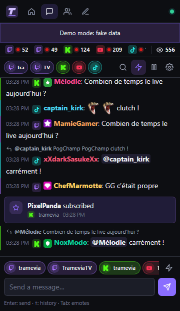
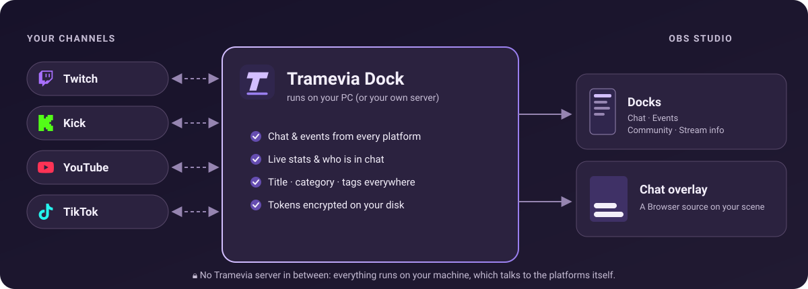
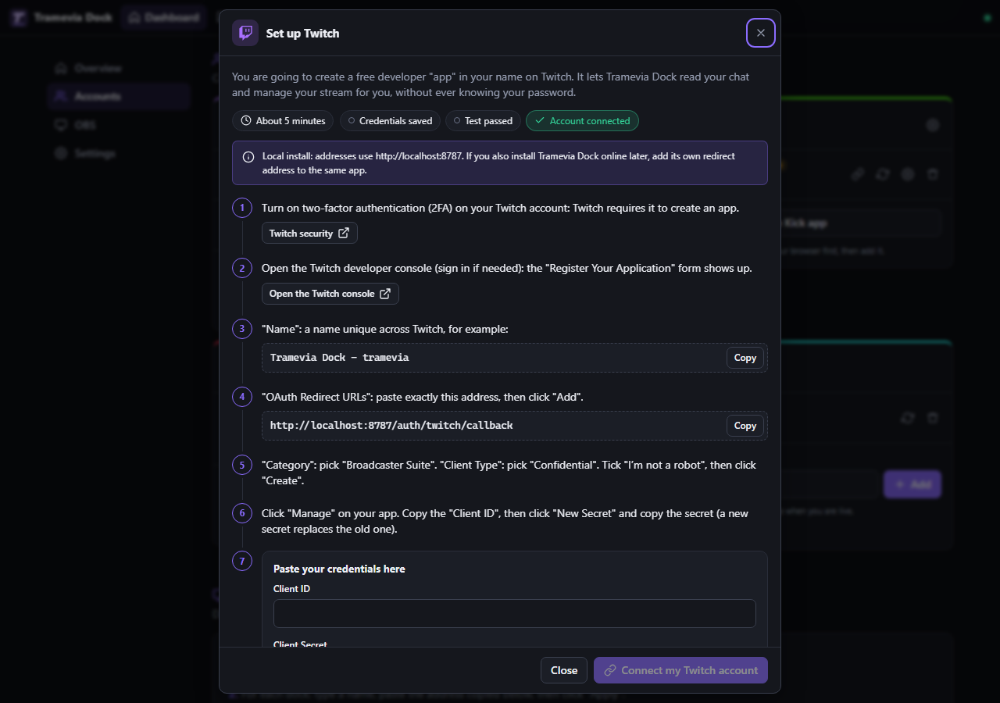
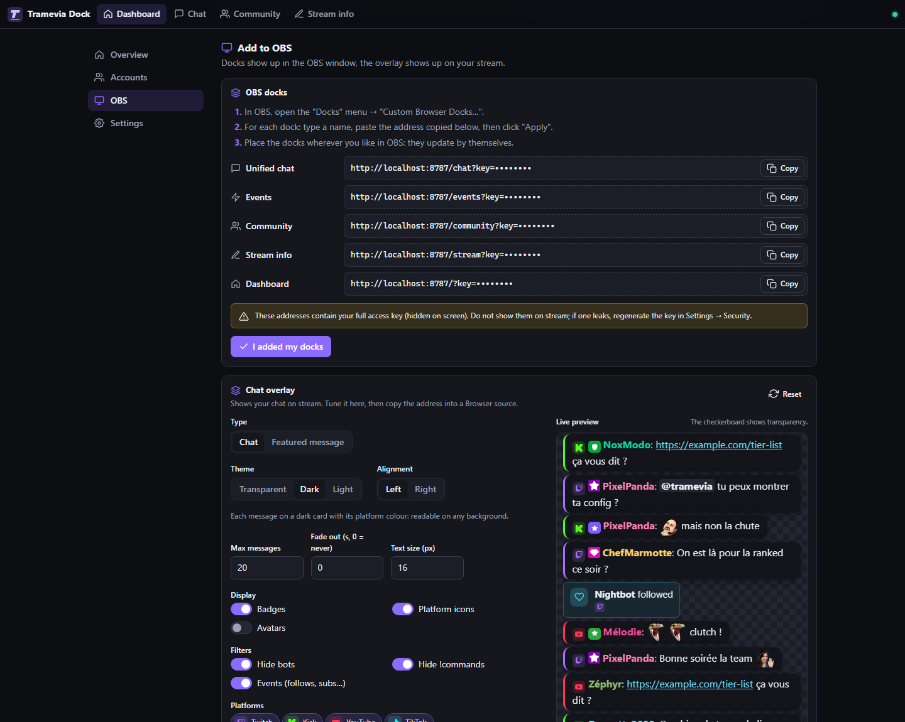
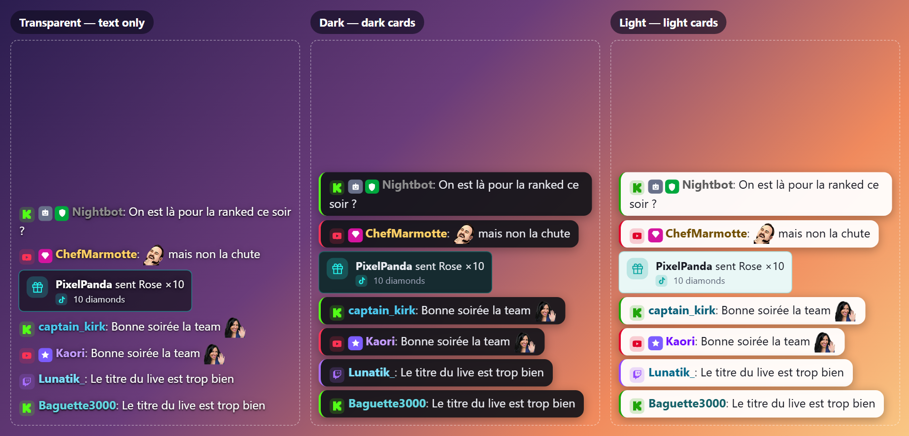
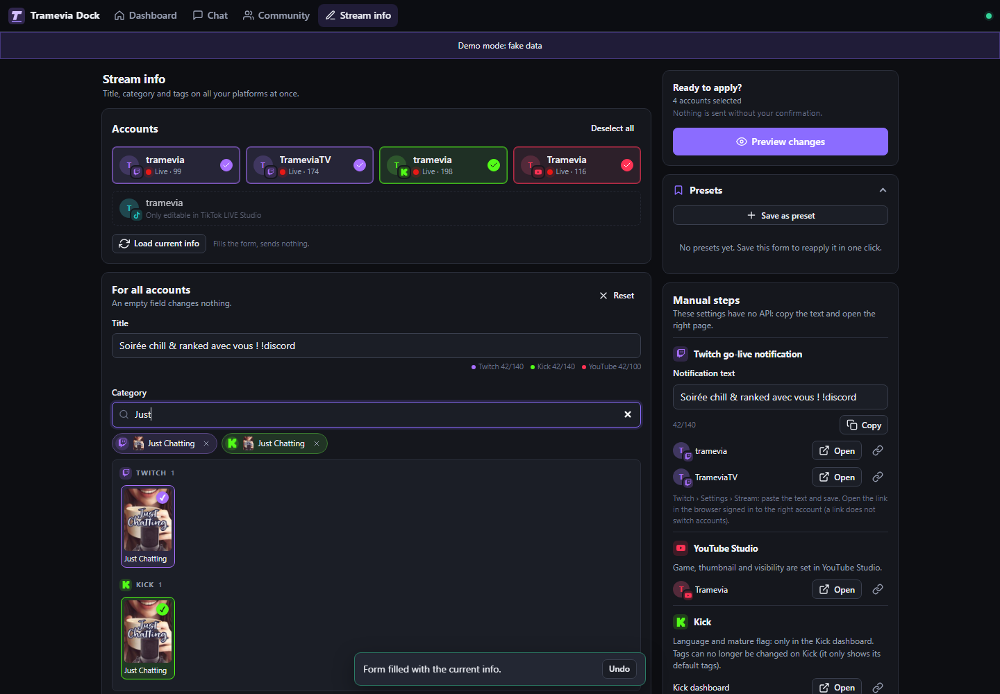
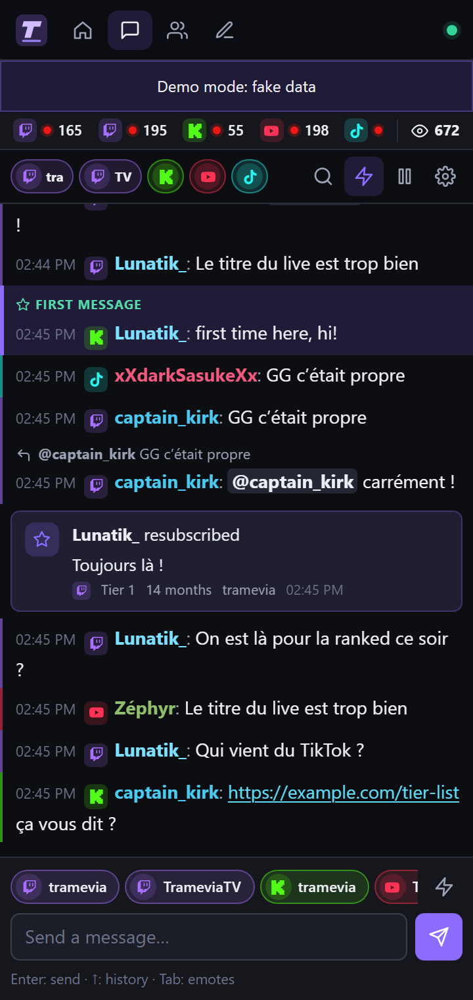
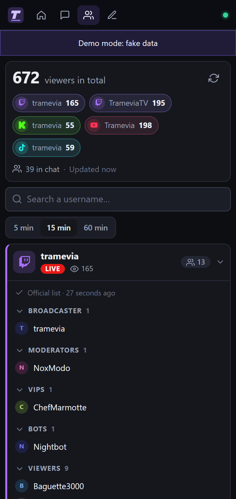

<p align="right"><a href="README.fr.md">🇫🇷 Français</a></p>

<p align="center">
  
</p>

<h1 align="center">Tramevia Dock</h1>

<p align="center">
  <b>All your chats, all your stream info, one tidy place in OBS.</b><br>
  Twitch, Kick, YouTube and TikTok LIVE together, running on your own PC. Free, and you don't need to know how to code.
</p>

<p align="center">
  <a href="LICENSE"></a>
  
  
  
  
</p>

<p align="center">
  <a href="#install"><b>Install</b></a> ·
  <a href="#tutorial"><b>Tutorial</b></a> ·
  <a href="#features"><b>Features</b></a> ·
  <a href="#faq"><b>FAQ</b></a>
</p>


### 👀 See it live

<table>
  <tr>
    <td width="50%" align="center">
      
    </td>
    <td width="50%">
      <ul>
        <li>💬 <b>Every chat in one list.</b> Each message shows a small icon, so you always know where it comes from.</li>
        <li>✍️ <b>Answer from OBS.</b> Reply to a message, or send one message to several channels at once.</li>
        <li>🛡️ <b>Moderate on the spot.</b> Delete, timeout, ban and unban without opening five tabs.</li>
        <li>🎉 <b>Never miss a thank-you.</b> Follows, subs, gifts, raids and Super Chats appear right in the chat.</li>
      </ul>
    </td>
  </tr>
</table>

## 💜 Why Tramevia Dock?

- 💬 **One chat for every platform.** Read, write and moderate Twitch, Kick and YouTube from a single panel, with your TikTok LIVE chat alongside.
- 🏷️ **Title, category and tags everywhere in one click.** Fill the form once, check the preview, apply to all your channels. Save your usual setups as presets.
- 🏠 **Your data stays home.** It runs on your own PC. There is no account to create with us, no Tramevia server in the middle, and your logins are encrypted on your disk.
- 🎁 **Free and open source.** No subscription, no ads. The interface is in English and French.

## 🧭 How it works



Tramevia Dock is a small program that runs on your computer. It talks **directly** to Twitch, Kick, YouTube and TikTok, and gives OBS two things:

- **Docks**: panels inside the OBS window (chat, events, community, stream info). Only you see them.
- **A chat overlay**: a see-through layer on your scene that shows your chat to your viewers.

<a id="tutorial"></a>

## 🚀 Tutorial: from zero to your first live in ~10 minutes

No coding needed. Follow the pictures, one step at a time. ☕

**You need:** a Windows, macOS or Linux computer, [OBS Studio](https://obsproject.com) 31 or newer, and an internet connection.

<a id="install"></a>

### 1️⃣ Install Tramevia Dock

1. **Install Node.js.** It is the free engine that runs Tramevia Dock. Go to [nodejs.org](https://nodejs.org), download the **LTS** version (24.15 or newer) and install it. Keep the default options.
2. **Download Tramevia Dock.** On [its GitHub page](https://github.com/Tramevia/Tramevia-Dock), click the green **Code** button → **Download ZIP** (or take the ZIP from the Releases page, when there is one).
3. **Extract the ZIP.** Right-click it → *Extract All*, and pick a folder you will keep, for example `Documents\TrameviaDock`.
4. **Double-click `start.bat`.** If Windows shows a security warning (the file came from the internet), choose to run it. A black window opens. The first time, it installs what it needs (about a minute).
5. **Your browser opens at http://localhost:8787.** That's your dashboard. 🎉

On macOS, double-click `start.command`. On Linux, run `./start.sh`. Details in [Other ways to install](#other-ways-to-install).


<p align="center"><sub>The dashboard. The setup card at the top lists what's left to do: create your developer app, connect your accounts, add the docks to OBS. Steps 2 and 3 below show you how.</sub></p>

> [!TIP]
> **Just curious?** Double-click **`demo.bat`** instead (`./start.sh --demo` on macOS and Linux). Every page fills up with fake channels, chat and events. Nothing to set up, and nothing is sent to any platform. All the screenshots on this page come from demo mode.

> [!IMPORTANT]
> Keep the black window open while you stream. Closing it stops Tramevia Dock, and your OBS docks go blank.

### 2️⃣ Connect your first platform

Twitch, Kick and YouTube ask you to create a free **developer app** in your own name. Don't worry about the name: it is just a permission you create on the platform's website. It lets Tramevia Dock read your chat and update your stream info, **without ever knowing your password**. The wizard shows you every click.

1. In the dashboard, open **Accounts** and click **Set up the Twitch app** on the Twitch card.
2. Follow the numbered steps. Buttons open the right Twitch pages for you, and **Copy** buttons give you everything you need to paste. (Twitch asks you to turn on two-factor authentication first.)
3. Paste your **Client ID** and **Client Secret** in the last step, then click **Save and test**.
4. Click **Connect my Twitch account** and approve on the Twitch page. Done! ✅



> [!NOTE]
> Count about **5 minutes per platform**. Kick and YouTube work the same way. On YouTube, Google warns that the app is "unverified": that's expected, it's your own app. **TikTok is even simpler:** type your @username in the TikTok card and click **Add**. Step-by-step guide for each platform: [Connect your platforms](docs/en/platforms.md).

### 3️⃣ Add the docks to OBS

1. In the dashboard, open **OBS**. Under **OBS docks**, click **Copy** next to a dock (start with **Unified chat**).
2. In OBS, open the **Docks** menu → **Custom Browser Docks…**
3. Type a name on the left, paste the address on the right, and click **Apply**.
4. Do the same for the other docks you want, then drag them where you like in the OBS window.
5. Back in the dashboard, click **I added my docks**.



> [!IMPORTANT]
> You need **OBS Studio 31 or newer**. The chat dock doesn't work properly in OBS 30's older built-in browser.

> [!WARNING]
> The dock addresses contain your personal access key. **Don't show them on stream** and don't share them. If one leaks, get a new key in **Settings → Security**.

### 4️⃣ Put the chat on your stream

The **overlay** is the chat your viewers see on top of your game.

1. In the dashboard's **OBS** section, scroll down to **Chat overlay**.
2. Pick a **Theme** and play with the options. The **Live preview** updates as you go.
3. Copy the **Overlay address**.
4. In OBS: **Sources → + → Browser**, give it a name, paste the address in **URL**, set **Width 400** and **Height 600**, then click **OK**.



- **Transparent**: text only, right on top of your scene. Turn on *Bubbles* or *Text outline* if your background is busy.
- **Dark**: each message on a dark card with its platform colour. Readable on any background.
- **Light**: each message on a light card with dark text.

> [!TIP]
> The overlay address uses a separate **read-only** key: it can show your chat, but it can't act on your accounts. Want to put just one message on screen? Add a second Browser source with the *Featured message* type, then click **Show on overlay** on a message in the Chat dock. All options: [OBS guide](docs/en/obs.md).

### 5️⃣ Before each live: set your title everywhere at once

1. Open the **Stream info** dock and check that the channels you want are ticked.
2. Click **Load current info**. It fills the form with what's online now, and sends nothing.
3. Change the **Title**, **Category** (one search for every platform, with box art) and **Tags**.
4. Click **Preview changes**, check the before and after, then click **Apply to … accounts**. You get a result for each channel.
5. Same setup every Tuesday? Open **Presets** → **Save as preset**, and next time it's one click.



> [!TIP]
> Nothing is sent without your confirmation. On YouTube, schedule your stream in YouTube Studio first: the title lives on a live or scheduled broadcast. The TikTok LIVE title can only be changed in the TikTok app or LIVE Studio.

**That's it, you're ready to go live!** 🎬 Stuck somewhere? Check the [FAQ](#faq) or the [troubleshooting guide](docs/en/faq.md).

<a id="features"></a>

## ✨ Features

<table>
  <tr>
    <td width="50%" align="center" valign="top">
      <br>
      <b>💬 Unified chat</b><br>
      <sub>Every chat in one list, with emotes, badges, replies and moderation.</sub>
    </td>
    <td width="50%" align="center" valign="top">
      <br>
      <b>👥 Community</b><br>
      <sub>Total viewers and who is in your chat, by role.</sub>
    </td>
  </tr>
  <tr>
    <td width="50%" align="center" valign="top">
      <br>
      <b>🏷️ Stream info</b><br>
      <sub>Title, category and tags for all your channels, with presets.</sub>
    </td>
    <td width="50%" align="center" valign="top">
      <br>
      <b>📺 Overlay</b><br>
      <sub>Your chat on stream, set up with a visual builder.</sub>
    </td>
  </tr>
  <tr>
    <td colspan="2" align="center">
      <br>
      <b>🏠 Dashboard</b><br>
      <sub>Setup, accounts, OBS addresses and settings in one place.</sub>
    </td>
  </tr>
</table>

<details>
<summary><b>📋 The full feature list</b></summary>

<br>

- **Chat:** one list for all your accounts, with a filter per account, search, pause on hover and a "new messages" pill · native emotes plus 7TV, BetterTTV and FrankerFaceZ · badges, Twitch cheermotes, links, mentions and replies · send to one or several channels at once ("Send to") · message history with ↑ and emote completion with Tab · delete, timeout, ban and unban · user card with their messages from this session (and, on Twitch, the account creation date and "Following since") · highlights for first messages, mentions and your own keywords, with an optional sound when you're mentioned · Twitch stream markers and clips in one click.
- **Events:** follows, subs, gifted subs, cheers, KICKs, Super Chats, Super Stickers, memberships, Jewels, raids, channel point redemptions and TikTok gifts.
- **Community:** combined viewer count and the detail per channel · the real Twitch chatter list, grouped by role (broadcaster, moderators, VIPs, bots) · "active chatters" from the last 5, 15 or 60 minutes on Kick, YouTube and TikTok, which don't share that list.
- **Stream info:** title, category (one search on every platform, with box art) and tags for all your channels · per-account overrides · Twitch language, content classification and branded content · YouTube description and category · presets · preview before sending, a result per channel, and a button to retry only the ones that failed · copy-and-open shortcuts for settings that have no API (Twitch go-live notification, YouTube "Game").
- **Overlay:** transparent chat overlay for an OBS Browser source, with three themes and a visual builder with live preview · "Featured message" mode to put one message on screen from the Chat dock.
- **Setup & security:** a wizard for each platform with the exact addresses to paste and a test button · several accounts per platform (two Twitch channels, for example) · tokens encrypted on disk · password required as soon as the app is reachable from the network · dock and overlay keys you can regenerate · runs on Windows, macOS or Linux, or online with Docker or Railway · English and French interface.

</details>

## 🌐 Supported platforms

✅ official API · 🟡 official but limited · ⚠️ unofficial · ❌ not possible

| | Twitch | Kick | YouTube | TikTok LIVE |
|---|---|---|---|---|
| Read chat | ✅ | ✅ webhooks (online install)<br>⚠️ Pusher (local install) | ✅ | ⚠️ read-only |
| Send messages | ✅ | ✅ | 🟡 200 characters, uses quota | ❌ |
| Reply to a message | ✅ | ✅ | ❌ | ❌ |
| Moderation (delete, timeout, ban, unban) | ✅ | ✅ timeouts in whole minutes | 🟡 uses quota; unban only for bans made from Tramevia Dock | ❌ |
| Chatter list | ✅ official list with roles | 🟡 active chatters | 🟡 active chatters | ⚠️ active chatters |
| Live status and viewers | ✅ | ✅ | ✅ unless you hide the count | ⚠️ |
| Title | ✅ | ✅ | ✅ needs a live or scheduled broadcast | ❌ TikTok app / LIVE Studio only |
| Category | ✅ search with box art | ✅ search with box art | 🟡 YouTube category list ("Game" only in Studio) | ❌ |
| Tags | ✅ | ❌ no longer editable on Kick | ✅ | ❌ |
| Events | ✅ follows, subs, gifts, cheers, raids, redemptions | 🟡 follows, subs, gifts, KICKs, redemptions | 🟡 Super Chats, Super Stickers, memberships, Jewels (no follows) | ⚠️ gifts, follows, shares, subs, likes |
| Stream markers and clips | ✅ | ❌ | ❌ | ❌ |

> [!NOTE]
> **Good to know**
> - **TikTok LIVE** has no public API. Tramevia Dock reads it through an unofficial, read-only connection ([tiktok-live-connector](https://github.com/zerodytrash/TikTok-Live-Connector)). It can stop working after a TikTok update.
> - **Kick chat on a local install** goes through Kick's unofficial Pusher socket, because Kick's official webhooks need a public HTTPS address. Official webhooks work when Tramevia Dock runs [in the cloud](docs/en/cloud.md).
> - **YouTube** gives each Google Cloud project 10,000 API units per day. Sending a message or a moderation action costs 50 units. A meter in the app shows what you have used.
> - Some settings have no API on any platform (for example the Twitch go-live notification). The Stream info page gives you a copy button and a link to the right page instead.

All the details, platform by platform: [Connect your platforms](docs/en/platforms.md).

<a id="other-ways-to-install"></a>

## 📦 Other ways to install

<details>
<summary><b>🪟 Windows, step by step</b></summary>

<br>

1. **Install Node.js.** Go to [nodejs.org](https://nodejs.org), download the **LTS** installer (24.15 or newer) and run it. Click *Next* through the screens and keep the default options.
2. **Download Tramevia Dock** as a ZIP from [its GitHub page](https://github.com/Tramevia/Tramevia-Dock) (green **Code** button → **Download ZIP**).
3. **Extract the ZIP** (right-click → *Extract All*) into a folder you will keep, for example `Documents\TrameviaDock`. Don't run it from inside the ZIP.
4. **Double-click `start.bat`.** If Windows shows a security warning because the file came from the internet, choose to run it.
5. A black window opens. The first time, it installs the dependencies (about a minute). Then your browser opens at **http://localhost:8787**.

If Node.js is missing, `start.bat` tells you and opens nodejs.org. If it's too old, `start.bat` asks you to update it. Then double-click `start.bat` again.

**Updating:** download the new ZIP, extract it to a new folder, and copy your old `data` folder (and your `.env` file, if you have one) into it. Full guide: [Installation](docs/en/install.md).

</details>

<details>
<summary><b>🍎 macOS and 🐧 Linux</b></summary>

<br>

**macOS:** install Node.js 24.15 or newer from [nodejs.org](https://nodejs.org), unzip Tramevia Dock into a folder you will keep, and double-click **`start.command`**. If macOS blocks it because it comes from an unidentified developer, allow it once in **System Settings → Privacy & Security → Open Anyway** (on older versions: right-click the file → **Open**).

**Linux:** install Node.js 24.15 or newer, then run:

```bash
git clone https://github.com/Tramevia/Tramevia-Dock.git
cd Tramevia-Dock
./start.sh
```

You can also download the ZIP, extract it and run `./start.sh` in that folder. Keep the terminal window open while you stream. Full guide: [Installation](docs/en/install.md).

</details>

<details>
<summary><b>🐳 Docker</b></summary>

<br>

1. In the Tramevia Dock folder, create a file named `.env` with at least a password (12 characters or more):

   ```env
   ADMIN_PASSWORD=choose-a-long-password
   ```

2. Start it:

   ```bash
   docker compose up -d
   ```

3. Open http://localhost:8787 and sign in with your password.

Your data is kept in a Docker volume named `tramevia-data`. Full guide: [Cloud and Docker](docs/en/cloud.md).

</details>

<details>
<summary><b>☁️ Railway and other cloud hosts</b></summary>

<br>

Running Tramevia Dock online lets you open it from anywhere, keeps it running when your PC is off, and unlocks Kick's official webhooks.

- On [Railway](https://railway.com) (a paid service): deploy from your own copy of the repository, attach a volume at **`/data`**, set **`ADMIN_PASSWORD`**, and generate a public domain.
- Any host that runs a Docker image with a persistent volume at `/data` and HTTPS in front works too.

Online, `ADMIN_PASSWORD` (12 characters or more) is mandatory, and the redirect addresses you register on each platform change. Full guide: [Cloud and Docker](docs/en/cloud.md).

</details>

<a id="faq"></a>

## ❓ FAQ

<details>
<summary><b>Is it really free?</b></summary>

<br>

Yes. Tramevia Dock is free and open source. The developer apps on Twitch, Kick and Google are free too, and so is the YouTube API within its daily quota. A local install costs nothing more. If you choose to host it online (Railway, your own server…), you pay that host.

</details>

<details>
<summary><b>Do I need to know how to code?</b></summary>

<br>

No. You double-click a file to start it, and the wizard shows you every click, with **Copy** buttons for everything you need to paste. Creating the free developer apps is the only "technical" part, and it takes about 5 minutes per platform.

</details>

<details>
<summary><b>Is it safe? Where are my passwords?</b></summary>

<br>

Tramevia Dock **never sees your platform passwords**: you sign in on each platform's own page. What it keeps (access tokens and app secrets) is encrypted in the `data` folder on your PC. By default it only answers your own computer. You can cut its access at any time with **Disconnect**.

Back up the whole `data` folder, including `secret.key`: without that file, the saved logins can't be read and you would have to reconnect everything.

</details>

<details>
<summary><b>Does it work with Streamlabs or other streaming software?</b></summary>

<br>

Tramevia Dock is made for **OBS Studio** (version 31 or newer): the docks are OBS custom browser docks, and the chat overlay is an OBS Browser source. The dashboard and every dock are also normal web pages, so you can keep them open in any browser window, next to whatever software you use.

</details>

<details>
<summary><b>Why is TikTok "unofficial"?</b></summary>

<br>

TikTok has no public API for LIVE. Tramevia Dock uses the open-source library [tiktok-live-connector](https://github.com/zerodytrash/TikTok-Live-Connector), which reads the same feed as the TikTok app. So TikTok is **read-only** (chat, gifts, follows, viewers: no sending, no moderation), it needs no password, and it can stop working after a TikTok update until the library and Tramevia Dock are updated.

</details>

<details>
<summary><b>Does Kick chat work on a local install?</b></summary>

<br>

Yes. Kick's official chat webhooks need a public HTTPS address, which a home PC doesn't have. So on a local install, Kick chat is read through the same unofficial chat socket (Pusher) that kick.com uses. Sending messages, moderation and stream info still go through Kick's official API. For the official webhooks, run Tramevia Dock [online or behind a tunnel](docs/en/cloud.md).

</details>

<details>
<summary><b>What is the YouTube quota?</b></summary>

<br>

Google gives each Google Cloud project **10,000 units per day**, shared by every YouTube channel using that app, reset at midnight Pacific time. Reading chat costs very little; sending a message or a moderation action costs 50 units, applying stream info about 51. A meter shows your usage on the YouTube account and in the Chat dock. At 95%, Tramevia Dock pauses sending, moderation and stream info changes on YouTube until the reset. It never moderates by itself, so nothing spends quota behind your back.

</details>

<details>
<summary><b>Can I use it on two PCs?</b></summary>

<br>

Yes, in two ways:

- **On your home network:** run it on one PC and open it from the other. You need to open it to your network, set a password and allow the other address: see [Cloud and Docker](docs/en/cloud.md#other-hosts-and-reverse-proxies).
- **Online:** host it with Docker or Railway, and every device reaches the same install.

Moving to a new PC? Copy the Tramevia Dock folder **with its `data` folder**: see [I moved to a new PC](docs/en/faq.md#i-moved-to-a-new-pc).

</details>

More answers and fixes for common errors: [FAQ and troubleshooting](docs/en/faq.md).

<a id="security--privacy"></a>

## 🔒 Security & privacy

- **Self-hosted.** Tramevia Dock runs on your computer or your server. Your access tokens only travel between your install and the platforms themselves. There is no Tramevia server in the middle, and no tracking.
- **No platform passwords.** You sign in on each platform's own page. Tramevia Dock never sees your password.
- **Encrypted.** Your access tokens and app secrets are encrypted on your disk.
- **Only your PC, by default.** Out of the box, Tramevia Dock only answers your own computer. As soon as it can be reached from the network (online, home network, tunnel), a password is required.
- **Keys you can change.** Dock addresses contain a full-access key, the overlay address a separate read-only key. Treat them like passwords, and get new ones in **Settings → Security** if one leaks.
- **Disconnect** removes an account and its tokens from the database and asks the platform to revoke them.

<details>
<summary><b>Technical details: encryption, what is stored, which services are contacted</b></summary>

<br>

**Sign-in and encryption.** You connect each platform with OAuth. OAuth tokens and app secrets are encrypted (AES-256-GCM) with a key from `TOKEN_KEY` or the `data/secret.key` file.

**Network.** Without `ADMIN_PASSWORD`, the server only listens on `127.0.0.1` and only answers this computer. As soon as it is reachable from the network (cloud, LAN, tunnel), `ADMIN_PASSWORD` is required (12 characters or more). Login attempts are rate-limited.

**Stored** in `data/tramevia-dock.db` on your machine: your platform app credentials (encrypted), connected accounts (name, avatar, granted permissions, encrypted tokens), presets and interface settings, the dock and overlay keys, the ids of chatters already seen (for the "first message" highlight), the ids of YouTube bans made from the app (so you can unban), the YouTube quota counter and your Kick chat room id. Chat messages and events are kept in memory only (the last 400) and are not written to disk.

**Other services contacted:** the platforms themselves, Kick's Pusher chat socket (for Kick chat in unofficial mode), the 7TV, BetterTTV and FrankerFaceZ emote APIs (with your channel id), and for TikTok the Euler Stream signing server used by tiktok-live-connector.

</details>

Tramevia Dock uses YouTube API Services. By connecting a YouTube account you agree to the [YouTube Terms of Service](https://www.youtube.com/t/terms), and Google's use of data is covered by the [Google Privacy Policy](https://policies.google.com/privacy). You can revoke Tramevia Dock's access to your Google account at any time from your [Google account permissions](https://security.google.com/settings/security/permissions).

Found a vulnerability? Please read [SECURITY.md](SECURITY.md) instead of opening a public issue.

## 🤝 Contributing, license and credits

**Contributing.** Ideas, bug reports and pull requests are welcome! Start with [CONTRIBUTING.md](CONTRIBUTING.md). Report a problem in the [issues](https://github.com/Tramevia/Tramevia-Dock/issues). What changed in each version: [CHANGELOG.md](CHANGELOG.md).

**License.** [AGPL-3.0](LICENSE). You are free to use, study and modify Tramevia Dock, on as many channels as you like. If you distribute a modified version, or host one for other people over a network, you must share its source code under the same license.

**Credits.**

- [tiktok-live-connector](https://github.com/zerodytrash/TikTok-Live-Connector) for TikTok LIVE (AGPL-3.0)
- [ws](https://github.com/websockets/ws) for WebSockets
- [Simple Icons](https://simpleicons.org) for the platform glyphs (CC0)
- [7TV](https://7tv.app), [BetterTTV](https://betterttv.com) and [FrankerFaceZ](https://www.frankerfacez.com) for third-party emotes

<sub>Tramevia Dock is an independent project. It is not affiliated with, endorsed or sponsored by Twitch, Kick, YouTube, Google or TikTok. All trademarks and logos belong to their owners and are only used to identify the platforms.</sub>
