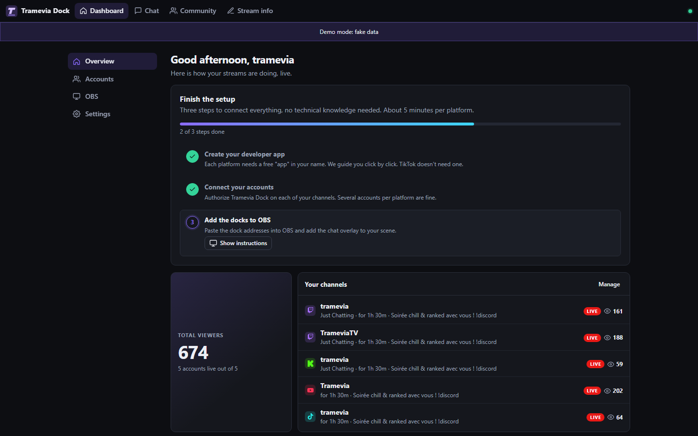

<p align="right"><a href="../fr/install.md">🇫🇷 Français</a></p>

# Installation

[← Back to the README](../../README.md) · [Platforms](platforms.md) · [OBS](obs.md) · [Cloud](cloud.md) · [FAQ](faq.md)

Tramevia Dock is a small program that runs on your own computer. You start it, it opens a page in your browser, and OBS shows its pages as docks. This guide covers Windows, macOS and Linux. If you would rather run it on a server, see [Cloud and Docker](cloud.md).

## Requirements

| What | Details |
|---|---|
| Computer | Windows 10 or 11, macOS or Linux |
| [Node.js](https://nodejs.org) | Version **24.15 or newer** (the LTS version is fine). It is the engine that runs Tramevia Dock. |
| OBS Studio | Version 31 or newer (its built-in browser supports everything the docks use; OBS 30's is too old for the chat dock) |
| Internet | Needed at the first launch (to download the dependencies) and, of course, to talk to the platforms |

You do not need to know how to code. Each platform you want to use also needs a free developer app in your name: the setup wizard walks you through it (see [Platforms](platforms.md)).

## Windows

1. **Install Node.js.** Go to [nodejs.org](https://nodejs.org), download the **LTS** installer and run it. Click *Next* through the screens and keep the default options.
2. **Download Tramevia Dock** as a ZIP file from [its GitHub page](https://github.com/Tramevia/Tramevia-Dock) (green **Code** button → **Download ZIP**, or the latest release).
3. **Extract the ZIP.** Right-click the file → *Extract All*. Pick a folder you will keep, for example `Documents\TrameviaDock`. Do not run Tramevia Dock from inside the ZIP: extract it first.
4. **Double-click `start.bat`** in that folder. Windows may show a security warning because the file came from the internet: choose to run it.
5. A black window opens. The first time, it installs the dependencies (about a minute). Then your browser opens at **http://localhost:8787**.
6. Follow the setup wizard on the dashboard.

> [!IMPORTANT]
> Keep the black window open while you use Tramevia Dock. Closing it (or pressing <kbd>Ctrl</kbd>+<kbd>C</kbd> in it) stops the program, and your OBS docks go blank.

If Node.js is missing, `start.bat` says so and opens nodejs.org for you. If it is too old, `start.bat` asks you to update it. Install or update Node.js, then double-click `start.bat` again.

> [!TIP]
> To open a terminal in the Tramevia Dock folder (for the `--demo` option, for example), click the address bar of the File Explorer window, type `cmd` and press <kbd>Enter</kbd>.

## macOS

1. Install Node.js 24.15 or newer from [nodejs.org](https://nodejs.org) (LTS installer).
2. Download and unzip Tramevia Dock into a folder you will keep, for example in *Documents*.
3. Double-click **`start.command`**. A Terminal window opens, installs the dependencies the first time, then opens your browser at http://localhost:8787.

If macOS refuses to open `start.command` because it comes from an unidentified developer:

- on macOS 15 or newer, open **System Settings → Privacy & Security**, scroll down and click **Open Anyway** next to the message about `start.command`;
- on older versions, right-click (or <kbd>Control</kbd>-click) the file, choose **Open**, then confirm with **Open**.

You only need to do this once.

If double-clicking does nothing, open Terminal in the folder and run `./start.sh`.

Keep the Terminal window open while you stream.

## Linux

Install Node.js 24.15 or newer (from [nodejs.org](https://nodejs.org) or your distribution's packages), then:

```bash
git clone https://github.com/Tramevia/Tramevia-Dock.git
cd Tramevia-Dock
./start.sh
```

You can also download and extract the ZIP and run `./start.sh` in that folder. The script checks your Node.js version, installs the dependencies the first time and starts the server. It tries to open http://localhost:8787 in your browser.

## First launch

When Tramevia Dock starts for the first time:

- it creates a **`data`** folder next to the program. Everything you set up lives there: the database `tramevia-dock.db` (accounts, app credentials, presets, settings) and **`secret.key`**;
- it opens the dashboard at http://localhost:8787. Without a password, the dashboard only works from this computer (a banner in **Settings → Security** reminds you);
- the dashboard shows the three setup steps: **Create your developer app**, **Connect your accounts**, **Add the docks to OBS**.



> [!WARNING]
> `data/secret.key` is the key that encrypts your tokens and app secrets. **Back up the whole `data` folder, including this file.** Without it, the saved credentials cannot be read: you would have to enter your app credentials again and reconnect every account.

Next step: [connect your platforms](platforms.md).

## Updating

Your settings are all in the `data` folder (and in `.env` if you created one). Keep them and replace the rest.

**With the ZIP:**

1. Stop Tramevia Dock (close its window).
2. Download the new ZIP and extract it to a **new** folder.
3. Copy your old `data` folder (and your `.env` file, if you have one) into the new folder.
4. Start the new version with `start.bat`, `start.command` or `start.sh`. It installs its dependencies on the first start.

You can also extract the new files over the old ones: at every start, the scripts check the installed dependencies and reinstall them when they are missing or out of date.

**With git:**

```bash
git pull
npm ci --omit=dev
```

Then start it as usual. Your OBS dock addresses keep working after an update.

## Uninstall

1. In the dashboard, **Disconnect** each account (Accounts section). This asks each platform to revoke Tramevia Dock's access.
2. Stop Tramevia Dock and delete its folder (this deletes `data` too).
3. Remove the docks and the Browser source from OBS.
4. Optional: delete the developer apps you created (Twitch developer console, Kick → Settings → Developer, your Google Cloud project), and uninstall Node.js if nothing else uses it.

## Configuration reference

You do not need any configuration for a local install. To change a setting, copy `.env.example` to a new file named `.env` in the Tramevia Dock folder, remove the `#` in front of the line you want and set its value. Restart Tramevia Dock afterwards.

> [!TIP]
> On Windows, if Notepad saves the file as `.env.txt`, choose *Save as type: All files* and type the name `.env`.

| Variable | Default | What it does |
|---|---|---|
| `PORT` | `8787` | Port the server listens on. |
| `PUBLIC_URL` | `http://localhost:<PORT>` (on Railway: `https://` + your Railway domain) | The address you use to open Tramevia Dock, without any path (for example `https://dock.example.com`). Every redirect address you register on the platforms is built from it: `PUBLIC_URL/auth/<platform>/callback`. |
| `ADMIN_PASSWORD` | empty | Dashboard password, 12 characters or more. **Required** as soon as the app is reachable from the network (`HOST` is not `127.0.0.1`, or `PUBLIC_URL` is not localhost). Without it, Tramevia Dock refuses to start in those cases. |
| `TOKEN_KEY` | empty (a key is generated in `DATA_DIR/secret.key`) | Key used to encrypt stored tokens and secrets, 32 characters or more. If you change it later, you will have to re-enter app credentials and reconnect accounts. |
| `DATA_DIR` | `./data` (`/data` in Docker and on Railway) | Where the database and `secret.key` live. |
| `TWITCH_CLIENT_ID`, `TWITCH_CLIENT_SECRET` | empty | Twitch app credentials. Optional: you can enter them in the wizard instead. |
| `KICK_CLIENT_ID`, `KICK_CLIENT_SECRET` | empty | Kick app credentials (optional, same as above). |
| `YOUTUBE_CLIENT_ID`, `YOUTUBE_CLIENT_SECRET` | empty | Google OAuth client credentials (optional, same as above). |
| `TIKTOK_SIGN_API_KEY` | empty | Optional Euler Stream API key for the TikTok signing server (see [TikTok](platforms.md#tiktok)). |
| `HOST` | `127.0.0.1` (`0.0.0.0` in Docker and on Railway) | Network interface to listen on. `0.0.0.0` makes it reachable from your network and requires `ADMIN_PASSWORD`. |
| `ALLOWED_HOSTS` | empty | Extra host names Tramevia Dock accepts, comma-separated, for example `mypc.local:8787`. Requests for any other host get a "Host not allowed" error. |
| `OPEN_BROWSER` | opens the browser | Set to `0` so the browser does not open at startup. |

App credentials set as environment variables (both the ID and the secret) take priority over the wizard. The platform's card in **Accounts** then shows **App (env variables)**, and the wizard does not let you edit them.

`DEMO=1` is also accepted and does the same as `--demo` (see below).

## Demo mode

Demo mode lets you explore every page with fake data: two Twitch channels, Kick, YouTube and TikTok, with chat, events, viewer counts and stream info. Nothing is sent to any platform, and a **Demo mode: fake data** banner is shown at the top.

- Windows: double-click `demo.bat`.
- macOS / Linux: `./start.sh --demo`.
- If the dependencies are already installed: `npm run demo`.

All the screenshots in this documentation were taken in demo mode.

## Changing the port

Use this if another program already uses port 8787, or if you want to run two copies.

1. In `.env`, set for example `PORT=8790`. `PUBLIC_URL` follows automatically (`http://localhost:8790`), unless you set it yourself.
2. Restart Tramevia Dock.
3. **Update the redirect addresses on every platform.** They contain the port (`http://localhost:8790/auth/twitch/callback`…), and the platforms only accept an exact match. The wizard shows the new addresses.
4. Copy the new dock and overlay addresses into OBS (dashboard → **OBS**).

> [!NOTE]
> If you set `PUBLIC_URL` yourself, use `localhost`, not `127.0.0.1`: the redirect addresses are built from it, and some platforms (Kick) reject `127.0.0.1`. The wizard warns you if your address uses it.
